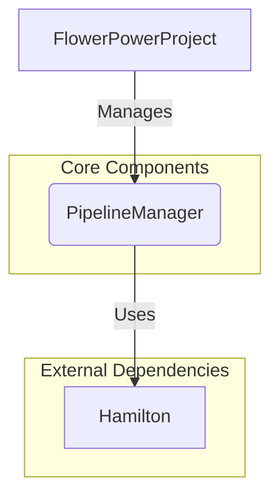

This file is a merged representation of the entire codebase, combining all repository files into a single document.
Generated by Repomix on: 2025-09-04 15:42:07

# File Summary

## Purpose:

This file contains a packed representation of the entire repository's contents.
It is designed to be easily consumable by AI systems for analysis, code review,
or other automated processes.

## File Format:

The content is organized as follows:
1. This summary section
2. Repository information
3. Repository structure
4. Multiple file entries, each consisting of:
   a. A header with the file path (## File: path/to/file)
   b. The full contents of the file in a code block

## Usage Guidelines:

- This file should be treated as read-only. Any changes should be made to the
  original repository files, not this packed version.
- When processing this file, use the file path to distinguish
  between different files in the repository.
- Be aware that this file may contain sensitive information. Handle it with
  the same level of security as you would the original repository.

## Notes:

- Some files may have been excluded based on .gitignore rules and Repomix's
  configuration.
- Binary files are not included in this packed representation. Please refer to
  the Repository Structure section for a complete list of file paths, including
  binary files.

## Additional Information:

For more information about Repomix, visit: https://github.com/andersonby/python-repomix


# Repository Structure

```
docs
  mkdocs
    docs
      api
        index.md
        flowerpowerproject.md
        initialize_project.md
        create_project.md
        flowerpower.md
        cli.md
        runconfig.md
        configuration.md
        cli_pipeline.md
      advanced.md
      installation.md
      index.md
      contributing.md
      architecture.md
      quickstart.md
      examples.md
examples
  data-etl-pipeline
    pipelines
      sales_etl.py
    scripts
      run_example.py
    conf
      pipelines
        sales_etl.yml
      project.yml
  ml-training-pipeline
    pipelines
      customer_churn.py
    scripts
      run_example.py
    conf
      pipelines
        customer_churn.yml
      project.yml
  pipeline-only-example
    pipelines
      text_processor.py
    scripts
      run_example.py
    conf
      pipelines
        text_processor.yml
      project.yml
  hello-world
    base
      pipelines
        hello_world.py
      conf
        pipelines
          hello_world.yml
        project.yml
  web-scraping-pipeline
    pipelines
      news_scraper.py
    scripts
      run_example.py
    conf
      pipelines
        news_scraper.yml
      project.yml
src
  flowerpower
    pipeline
      pipeline.py
      __init__.py
      visualizer.py
      base.py
    plugins
      io
        __init__.py
    flowerpower.py
    settings
      logging.py
      __init__.py
      retry.py
      hamilton.py
      general.py
      executor.py
    utils
      callback.py
      open_telemetry.py
      logging.py
      misc.py
      monkey.py
      templates.py
    __init__.py
    cfg
      pipeline
        _schedule.py
        adapter.py
        __init__.py
        run.py
        builder.py
      __init__.py
      project
        adapter.py
        __init__.py
      base.py
    cli
      pipeline.py
      cfg.py
      utils.py
      __init__.py
```

# Repository Files


## docs/mkdocs/docs/api/index.md

```markdown
# API Reference

This section provides a detailed reference for the FlowerPower API.

## Core Components

-   [FlowerPowerProject](./flowerpowerproject.md)
-   [PipelineManager](./pipelinemanager.md)
-   [RunConfig](./runconfig.md)

## Configuration

-   [Configuration](./configuration.md)

## Top-Level Functions

-   [initialize_project](./initialize_project.md)
-   [create_project](./create_project.md) (aliased as [FlowerPower](./flowerpower.md))

## CLI Reference

-   [CLI Overview](./cli.md)
-   [CLI Pipeline Commands](./cli_pipeline.md)
-   [CLI MQTT Commands](./cli_mqtt.md)
```

## docs/mkdocs/docs/api/flowerpowerproject.md

````markdown
# FlowerPowerProject

**Module:** [`flowerpower.flowerpower.FlowerPowerProject`](../../../src/flowerpower/flowerpower.py)

The `FlowerPowerProject` class represents an initialized FlowerPower project, providing an interface to manage pipelines and project-level settings.

## Initialization

### __init__

```python
__init__(self, pipeline_manager: PipelineManager)
...
```

Initializes a `FlowerPowerProject` instance. This constructor is typically called internally by `FlowerPowerProject.load()` or `FlowerPowerProject.new()`.

| Parameter | Type | Description |
|:----------|:-----|:------------|
| `pipeline_manager` | `PipelineManager` | An instance of `PipelineManager` to manage pipelines within this project. |

## Attributes

| Attribute | Type | Description |
|:----------|:-----|:------------|
| `pipeline_manager` | `PipelineManager` | Manages pipelines within the project. |
| `name` | `str` | The name of the current project. |
| `_base_dir` | `str` | The base directory of the project. |
| `_fs` | `AbstractFileSystem` | The fsspec-compatible filesystem instance used by the project. |
| `_storage_options` | `dict \| Munch \| BaseStorageOptions` | Storage options for the filesystem. |

## Methods

### run

```python
run(self, name: str, run_config: RunConfig | None = None, inputs: dict | None = None, final_vars: list[str] | None = None, config: dict | None = None, cache: dict | None = None, executor_cfg: str | dict | ExecutorConfig | None = None, with_adapter_cfg: dict | WithAdapterConfig | None = None, pipeline_adapter_cfg: dict | PipelineAdapterConfig | None = None, project_adapter_cfg: dict | ProjectAdapterConfig | None = None, adapter: dict[str, Any] | None = None, reload: bool = False, log_level: str | None = None, max_retries: int | None = None, retry_delay: float | None = None, jitter_factor: float | None = None, retry_exceptions: tuple | list | None = None, on_success: Callable | tuple[Callable, tuple | None, dict | None] | None = None, on_failure: Callable | tuple[Callable, tuple | None, dict | None] | None = None) -> dict[str, Any]
...
```

Execute a pipeline synchronously and return its results.

This is a convenience method that delegates to the pipeline manager. It provides the same functionality as `self.pipeline_manager.run()`.

This method supports two primary ways of providing execution configuration:
1. Using a `RunConfig` object (recommended): Provides a structured way to pass all execution parameters.
2. Using individual parameters (`**kwargs`): Allows specifying parameters directly, which will override corresponding values in the `RunConfig` if both are provided.

When both `run_config` and individual parameters (`**kwargs`) are provided, the individual parameters take precedence over the corresponding values in `run_config`.

| Parameter | Type | Description | Default |
|:----------|:-----|:------------|:--------|
| `name` | `str` | Name of the pipeline to run. Must be a valid identifier. | |
| `run_config` | `RunConfig \| None` | Configuration object containing all execution parameters. See [RunConfig](./runconfig.md) for details. | `None` |
| `inputs` | `dict \| None` | Override pipeline input values. Example: `{"data_date": "2025-04-28"}` | `None` |
| `final_vars` | `list[str] \| None` | Specify which output variables to return. Example: `["model", "metrics"]` | `None` |
| `config` | `dict \| None` | Configuration for Hamilton pipeline executor. Example: `{"model": "LogisticRegression"}` | `None` |
| `cache` | `dict \| None` | Cache configuration for results. Example: `{"recompute": ["node1", "final_node"]}` | `None` |
| `executor_cfg` | `str \| dict \| ExecutorConfig \| None` | Execution configuration, can be: <br>- `str`: Executor name, e.g. "threadpool", "local" <br>- `dict`: Raw config, e.g. `{"type": "threadpool", "max_workers": 4}` <br>- `ExecutorConfig`: Structured config object | `None` |
| `with_adapter_cfg` | `dict \| WithAdapterConfig \| None` | Adapter settings for pipeline execution. Example: `{"opentelemetry": True, "tracker": False}` | `None` |
| `pipeline_adapter_cfg` | `dict \| PipelineAdapterConfig \| None` | Pipeline-specific adapter settings. Example: `{"tracker": {"project_id": "123", "tags": {"env": "prod"}}}` | `None` |
| `project_adapter_cfg` | `dict \| ProjectAdapterConfig \| None` | Project-level adapter settings. Example: `{"opentelemetry": {"host": "http://localhost:4317"}}` | `None` |
| `adapter` | `dict[str, Any] \| None` | Custom adapter instance for pipeline Example: `{"ray_graph_adapter": RayGraphAdapter()}` | `None` |
| `reload` | `bool` | Force reload of pipeline configuration. | `False` |
| `log_level` | `str \| None` | Logging level for the execution. Valid values: "DEBUG", "INFO", "WARNING", "ERROR", "CRITICAL" | `None` |
| `max_retries` | `int \| None` | Maximum number of retries for execution. | `None` |
| `retry_delay` | `float \| None` | Delay between retries in seconds. | `None` |
| `jitter_factor` | `float \| None` | Random jitter factor to add to retry delay | `None` |
| `retry_exceptions` | `tuple \| list \| None` | Exceptions that trigger a retry. | `None` |
| `on_success` | `Callable \| tuple[Callable, tuple | None, dict | None] \| None` | Callback to run on successful pipeline execution. | `None` |
| `on_failure` | `Callable \| tuple[Callable, tuple | None, dict | None] \| None` | Callback to run on pipeline execution failure. | `None` |

**Returns:** `dict[str, Any]` - Pipeline execution results, mapping output variable names to their computed values.

**Raises:**

- `ValueError`: If pipeline name doesn't exist or configuration is invalid.
- `ImportError`: If pipeline module cannot be imported.
- `RuntimeError`: If execution fails due to pipeline or adapter errors.

#### Example

```python
from flowerpower import FlowerPowerProject
from flowerpower.cfg.pipeline.run import RunConfig
from flowerpower.cfg.pipeline.builder import RunConfigBuilder

project = FlowerPowerProject.load(".")

# Simple execution
result = project.run("my_pipeline")

# Using individual parameters (kwargs)
result = project.run(
    "ml_pipeline",
    inputs={"data_date": "2025-01-01"},
    final_vars=["model", "metrics"]
)

# Using RunConfig directly
config = RunConfig(
    inputs={"data_date": "2025-01-01"},
    final_vars=["model", "metrics"],
    log_level="DEBUG"
)
result = project.run("ml_pipeline", run_config=config)

# Using RunConfigBuilder from flowerpower.cfg.pipeline.builder (recommended)
config = (
    RunConfigBuilder()
    .with_inputs({"data_date": "2025-01-01"})
    .with_final_vars(["model", "metrics"])
    .with_log_level("DEBUG")
    .with_retry_config(max_retries=3, retry_delay=1.0)
    .build()
)
result = project.run("ml_pipeline", run_config=config)

# Mixing RunConfig with individual parameters (kwargs)
# Individual parameters take precedence over RunConfig values
base_config = RunConfigBuilder().with_log_level("INFO").build()
result = project.run(
    "ml_pipeline",
    run_config=base_config,
    inputs={"data_date": "2025-01-01"},  # Overrides inputs in base_config
    final_vars=["model"]  # Overrides final_vars in base_config
)
```

### load

```python
load(cls, base_dir: str | None = None, storage_options: dict | BaseStorageOptions | None = {}, fs: AbstractFileSystem | None = None, log_level: str | None = None) -> "FlowerPowerProject"
...
```

Load an existing FlowerPower project.

If the project does not exist, it will raise an error.

| Parameter | Type | Description | Default |
|:----------|:-----|:------------|:--------|
| `base_dir` | `str \| None` | The base directory of the project. If `None`, it defaults to the current working directory. | `None` |
| `storage_options` | `dict \| BaseStorageOptions \| None` | Storage options for the filesystem. | `{}` |
| `fs` | `AbstractFileSystem \| None` | An instance of `AbstractFileSystem` to use for file operations. If None, uses the `get_filesystem` helper. | `None` |
| `log_level` | `str \| None` | The logging level to set for the project. If `None`, it uses the default log level. | `None` |

**Returns:** `FlowerPowerProject` - An instance of `FlowerPowerProject` if the project exists, otherwise `None`.

**Raises:** `FileNotFoundError`: If the project does not exist at the specified base directory.

#### Example

```python
from flowerpower import FlowerPowerProject

# Load a project from the current directory
project = FlowerPowerProject.load(".")

# Load a project from a specific path
project = FlowerPowerProject.load("/path/to/my/project")
```

### new

```python
new(cls, name: str | None = None, base_dir: str | None = None, storage_options: dict | BaseStorageOptions | None = {}, fs: AbstractFileSystem | None = None, hooks_dir: str = settings.HOOKS_DIR, log_level: str | None = None) -> "FlowerPowerProject"
...
```

Initialize a new FlowerPower project.

| Parameter | Type | Description | Default |
|:----------|:-----|:------------|:--------|
| `name` | `str \| None` | The name of the project. If `None`, it defaults to the current directory name. | `None` |
| `base_dir` | `str \| None` | The base directory where the project will be created. If `None`, it defaults to the current working directory. | `None` |
| `storage_options` | `dict \| BaseStorageOptions \| None` | Storage options for the filesystem. | `{}` |
| `fs` | `AbstractFileSystem \| None` | An instance of `AbstractFileSystem` to use for file operations. If None, uses the `get_filesystem` helper. | `None` |
| `hooks_dir` | `str` | The directory where the project hooks will be stored. | `settings.HOOKS_DIR` |
| `log_level` | `str \| None` | The logging level to set for the project. If `None`, it uses the default log level. | `None` |

**Returns:** `FlowerPowerProject` - An instance of `FlowerPowerProject` initialized with the new project.

**Raises:** `FileExistsError`: If the project already exists at the specified base directory.

#### Example

```python
from flowerpower import FlowerPowerProject

# Initialize a new project in the current directory
project = FlowerPowerProject.new()

# Initialize a new project with a specific name
project = FlowerPowerProject.new(name="my-new-project")
```
````

## docs/mkdocs/docs/api/initialize_project.md

````markdown
# initialize_project

**Module:** `flowerpower.flowerpower`

The `initialize_project` function initializes a new FlowerPower project. It is a convenient top-level function that wraps `FlowerPowerProject.new()`.

```python
initialize_project(name: str | None = None, base_dir: str | None = None, storage_options: dict | BaseStorageOptions | None = {}, fs: AbstractFileSystem | None = None, hooks_dir: str = settings.HOOKS_DIR, log_level: str | None = None, overwrite: bool = False) -> FlowerPowerProject
```

Initializes a new FlowerPower project.

| Parameter | Type | Description |
|:----------|:-----|:------------|
| `name` | `str` &#124; `None` | The name of the project. Defaults to the current directory name. |
| `base_dir` | `str` &#124; `None` | The base directory where the project will be created. Defaults to the current working directory. |
| `storage_options` | `dict` &#124; `BaseStorageOptions` &#124; `None` | Storage options for the filesystem. |
| `fs` | `AbstractFileSystem` &#124; `None` | An instance of AbstractFileSystem to use for file operations. |
| `hooks_dir` | `str` | The directory where the project hooks will be stored. |
| `log_level` | `str` &#124; `None` | The logging level to set for the project. If None, it uses the default log level. |
| `overwrite` | `bool` | If True, deletes existing project files and creates a new plain project. |

**Returns:** A `FlowerPowerProject` instance initialized with the new project.

**Raises:** `FileExistsError` if the project already exists at the specified base directory and `overwrite` is `False`.

## Example

```python
from flowerpower import initialize_project

# Initialize a new project
project = initialize_project(name="my-new-project")

# Overwrite an existing project
project = initialize_project(name="my-existing-project", overwrite=True)
````

## docs/mkdocs/docs/api/create_project.md

````markdown
# create_project

**Module:** `flowerpower.flowerpower`

The `create_project` function either loads an existing FlowerPower project or raises an error if the project does not exist. It is a convenient top-level function.

```python
create_project(name: str | None = None, base_dir: str | None = None, storage_options: dict | BaseStorageOptions | None = {}, fs: AbstractFileSystem | None = None, hooks_dir: str = settings.HOOKS_DIR) -> FlowerPowerProject
```

Loads an existing FlowerPower project.

| Parameter | Type | Description |
|:----------|:-----|:------------|
| `name` | `str` &#124; `None` | The name of the project. Defaults to the current directory name. |
| `base_dir` | `str` &#124; `None` | The base directory where the project will be created or loaded from. Defaults to the current working directory. |
| `storage_options` | `dict` &#124; `BaseStorageOptions` &#124; `None` | Storage options for the filesystem. |
| `fs` | `AbstractFileSystem` &#124; `None` | An instance of AbstractFileSystem to use for file operations. |
| `hooks_dir` | `str` | The directory where the project hooks will be stored. |

**Returns:** A `FlowerPowerProject` instance.

**Raises:** `FileNotFoundError` if the project does not exist at the specified base directory.

## Example

```python
from flowerpower import create_project

# Load an existing project
project = create_project(base_dir=".")

# Attempt to load a non-existent project (will raise FileNotFoundError)
try:
    project = create_project(base_dir="./non_existent_project")
except FileNotFoundError as e:
    print(e)
```

```python
from flowerpower import FlowerPower

# Alias for create_project
project = FlowerPower(base_dir=".")
````

## docs/mkdocs/docs/api/flowerpower.md

````markdown
# FlowerPower

**Module:** [`flowerpower`](../../../src/flowerpower/__init__.py)

The `FlowerPower` name is an alias for the `create_project` function, which is the main entry point for initializing and interacting with FlowerPower projects. It acts as a factory for `FlowerPowerProject` instances, allowing users to load existing projects or create new ones.

**Note:** `FlowerPower` and `create_project` are functionally identical. `FlowerPower` is provided as an alias for convenience and backward compatibility.

## Initialization

### create_project (aliased as FlowerPower)

```python
create_project(name: str | None = None, base_dir: str | None = None, storage_options: dict | BaseStorageOptions | None = {}, fs: AbstractFileSystem | None = None, hooks_dir: str = settings.HOOKS_DIR) -> FlowerPowerProject
...
```

This function is called when you use `FlowerPower()` or `create_project()`. It checks if a project already exists at the specified `base_dir` and either loads it or initializes a new one.

| Parameter | Type | Description | Default |
|:----------|:-----|:------------|:--------|
| `name` | `str \| None` | The name of the project. If `None`, it defaults to the current directory name. | `None` |
| `base_dir` | `str \| None` | The base directory where the project will be created or loaded. If `None`, it defaults to the current working directory. | `None` |
| `storage_options` | `dict \| BaseStorageOptions \| None` | Storage options for the filesystem. | `{}` |
| `fs` | `AbstractFileSystem \| None` | An fsspec-compatible filesystem instance to use for file operations. If None, uses the `get_filesystem` helper. | `None` |
| `hooks_dir` | `str` | The directory where the project hooks will be stored. | `settings.HOOKS_DIR` |

**Returns:** `FlowerPowerProject` - An instance of `FlowerPowerProject` initialized with the new or loaded project.

#### Example

```python
from flowerpower import FlowerPower, create_project

# Initialize or load a project in the current directory using the alias
project = FlowerPower()

# Initialize or load a project in the current directory using the function name
project = create_project()

# Initialize or load a project with a specific name
project = FlowerPower(name="my-data-project")
```

For documentation on the `FlowerPowerProject` class and its methods, see [FlowerPowerProject](./flowerpowerproject.md).
````

## docs/mkdocs/docs/api/cli.md

````markdown
# CLI Reference

This section provides a comprehensive reference for the FlowerPower Command Line Interface (CLI).

## Main Commands

## flowerpower init { #flowerpower-init }

Initialize a new FlowerPower project.

This command creates a new FlowerPower project with the necessary directory structure
and configuration files. If no project name is provided, the current directory name
will be used as the project name.

### Usage

```bash
flowerpower init [options]
```

### Arguments

| Name | Type | Description | Default |
|---|---|---|---|
| project_name | str | Name of the FlowerPower project to create. If not provided, | Required |
| base_dir | str | Base directory where the project will be created. If not provided, | Required |
| storage_options | str | Storage options for filesystem access, as a JSON or dict string | Required |


### Examples

```bash
$ flowerpower init

# Create a project with a specific name
```

```bash
$ flowerpower init --name my-awesome-project

# Create a project in a specific location
```

```bash
$ flowerpower init --name my-project --base-dir /path/to/projects
```

---

## flowerpower ui { #flowerpower-ui }

Start the Hamilton UI web application.

This command launches the Hamilton UI, which provides a web interface for
visualizing and interacting with your FlowerPower pipelines. The UI allows you
to explore pipeline execution graphs and view results.

### Usage

```bash
flowerpower ui [options]
```

### Arguments

| Name | Type | Description | Default |
|---|---|---|---|
| port | str | Port to run the UI server on | Required |
| base_dir | str | Base directory where the UI will store its data | Required |
| no_migration | str | Skip running database migrations on startup | Required |
| no_open | str | Prevent automatically opening the browser | Required |
| settings_file | str | Settings profile to use (mini, dev, prod) | Required |
| config_file | str | Optional custom configuration file path | Required |


### Examples

```bash
$ flowerpower ui

# Run the UI on a specific port
```

```bash
$ flowerpower ui --port 9000

# Use a custom data directory
```

```bash
$ flowerpower ui --base-dir ~/my-project/.hamilton-data

# Start without opening a browser
```

```bash
$ flowerpower ui --no-open

# Use production settings
```

```bash
$ flowerpower ui --settings prod
```

---
````

## docs/mkdocs/docs/api/runconfig.md

````markdown
# RunConfig

**Module:** [`flowerpower.cfg.pipeline.run`](../../../../src/flowerpower/cfg/pipeline/run.py)

The `RunConfig` class encapsulates all configuration parameters for pipeline execution in FlowerPower. It provides a structured way to pass execution settings to both `Pipeline.run()` and `PipelineManager.run()` methods.

## Initialization

### __init__
```python
__init__(self, inputs: dict[str, Any] | None = None, final_vars: list[str] | None = None, config: dict[str, Any] | None = None, cache: dict[str, Any] | None = None, executor_cfg: str | dict | ExecutorConfig | None = None, with_adapter_cfg: dict | WithAdapterConfig | None = None, pipeline_adapter_cfg: dict | PipelineAdapterConfig | None = None, project_adapter_cfg: dict | ProjectAdapterConfig | None = None, adapter: dict[str, Any] | None = None, reload: bool = False, log_level: str | None = None, max_retries: int | None = None, retry_delay: float | None = None, jitter_factor: float | None = None, retry_exceptions: tuple | list | None = None, on_success: Callable | tuple[Callable, tuple | None, dict | None] | None = None, on_failure: Callable | tuple[Callable, tuple | None, dict | None] | None = None)
```

Initializes a `RunConfig` instance with execution parameters.

| Parameter | Type | Description | Default |
|:----------|:-----|:------------|:--------|
| `inputs` | `dict[str, Any] \| None` | Override pipeline input values. Example: `{"data_date": "2025-04-28"}` | `None` |
| `final_vars` | `list[str] \| None` | Specify which output variables to return. Example: `["model", "metrics"]` | `None` |
| `config` | `dict[str, Any] \| None` | Configuration for Hamilton pipeline executor. Example: `{"model": "LogisticRegression"}` | `None` |
| `cache` | `dict[str, Any] \| None` | Cache configuration for results. Example: `{"recompute": ["node1", "final_node"]}` | `None` |
| `executor_cfg` | `str \| dict \| ExecutorConfig \| None` | Execution configuration, can be: <br>- `str`: Executor name, e.g. "threadpool", "local" <br>- `dict`: Raw config, e.g. `{"type": "threadpool", "max_workers": 4}` <br>- `ExecutorConfig`: Structured config object | `None` |
| `with_adapter_cfg` | `dict \| WithAdapterConfig \| None` | Adapter settings for pipeline execution. Example: `{"opentelemetry": True, "tracker": False}` | `None` |
| `pipeline_adapter_cfg` | `dict \| PipelineAdapterConfig \| None` | Pipeline-specific adapter settings. Example: `{"tracker": {"project_id": "123", "tags": {"env": "prod"}}}` | `None` |
| `project_adapter_cfg` | `dict \| ProjectAdapterConfig \| None` | Project-level adapter settings. Example: `{"opentelemetry": {"host": "http://localhost:4317"}}` | `None` |
| `adapter` | `dict[str, Any] \| None` | Custom adapter instance for pipeline Example: `{"ray_graph_adapter": RayGraphAdapter()}` | `None` |
| `reload` | `bool` | Force reload of pipeline configuration. | `False` |
| `log_level` | `str \| None` | Logging level for the execution. Valid values: "DEBUG", "INFO", "WARNING", "ERROR", "CRITICAL" | `None` |
| `max_retries` | `int \| None` | Maximum number of retries for execution. | `None` |
| `retry_delay` | `float \| None` | Delay between retries in seconds. | `None` |
| `jitter_factor` | `float \| None` | Random jitter factor to add to retry delay | `None` |
| `retry_exceptions` | `tuple \| list \| None` | Exceptions that trigger a retry. | `None` |
| `on_success` | `Callable \| tuple[Callable, tuple \| None, dict \| None] \| None` | Callback to run on successful pipeline execution. | `None` |
| `on_failure` | `Callable \| tuple[Callable, tuple \| None, dict \| None] \| None` | Callback to run on pipeline execution failure. | `None` |

## Attributes

| Attribute | Type | Description |
|:----------|:-----|:------------|
| `inputs` | `dict[str, Any] \| None` | Override pipeline input values. |
| `final_vars` | `list[str] \| None` | Specify which output variables to return. |
| `config` | `dict[str, Any] \| None` | Configuration for Hamilton pipeline executor. |
| `cache` | `dict[str, Any] \| None` | Cache configuration for results. |
| `executor_cfg` | `str \| dict \| ExecutorConfig \| None` | Execution configuration. |
| `with_adapter_cfg` | `dict \| WithAdapterConfig \| None` | Adapter settings for pipeline execution. |
| `pipeline_adapter_cfg` | `dict \| PipelineAdapterConfig \| None` | Pipeline-specific adapter settings. |
| `project_adapter_cfg` | `dict \| ProjectAdapterConfig \| None` | Project-level adapter settings. |
| `adapter` | `dict[str, Any] \| None` | Custom adapter instance for pipeline. |
| `reload` | `bool` | Force reload of pipeline configuration. |
| `log_level` | `str \| None` | Logging level for the execution. |
| `max_retries` | `int \| None` | Maximum number of retries for execution. |
| `retry_delay` | `float \| None` | Delay between retries in seconds. |
| `jitter_factor` | `float \| None` | Random jitter factor to add to retry delay. |
| `retry_exceptions` | `tuple \| list \| None` | Exceptions that trigger a retry. |
| `on_success` | `Callable \| tuple[Callable, tuple \| None, dict \| None] \| None` | Callback to run on successful pipeline execution. |
| `on_failure` | `Callable \| tuple[Callable, tuple \| None, dict \| None] \| None` | Callback to run on pipeline execution failure. |

## Methods

### copy
```python
copy(self) -> 'RunConfig'
```

Create a shallow copy of the RunConfig instance.

**Returns:** `RunConfig` - A new RunConfig instance with the same configuration.

#### Example

```python
from flowerpower.cfg.pipeline.run import RunConfig

# Create a base configuration
base_config = RunConfig(
    inputs={"data_date": "2025-01-01"},
    log_level="INFO"
)

# Create a copy and modify it
custom_config = base_config.copy()
custom_config.final_vars = ["model", "metrics"]
```

### update
```python
update(self, **kwargs) -> 'RunConfig'
```

Update the RunConfig with new values and return self for method chaining.

| Parameter | Type | Description |
|:----------|:-----|:------------|
| `**kwargs` | `Any` | Key-value pairs of attributes to update. |

**Returns:** `RunConfig` - The updated RunConfig instance (self).

#### Example

```python
from flowerpower.cfg.pipeline.run import RunConfig

# Create a base configuration
config = RunConfig()

# Update multiple attributes
config.update(
    inputs={"data_date": "2025-01-01"},
    final_vars=["model", "metrics"],
    log_level="DEBUG"
)
```

# RunConfigBuilder

**Module:** [`flowerpower.cfg.pipeline.builder`](../../../../src/flowerpower/cfg/pipeline/builder.py)

The `RunConfigBuilder` class provides a fluent interface for constructing `RunConfig` instances. It allows for method chaining and provides a more readable way to build complex configurations.

## Initialization

### __init__
```python
__init__(self)
```

Initializes a new `RunConfigBuilder` instance with default values.

## Methods

### with_inputs
```python
with_inputs(self, inputs: dict[str, Any]) -> 'RunConfigBuilder'
```

Set the input values for the pipeline execution.

| Parameter | Type | Description |
|:----------|:-----|:------------|
| `inputs` | `dict[str, Any]` | Input values for the pipeline. |

**Returns:** `RunConfigBuilder` - The builder instance for method chaining.

#### Example

```python
from flowerpower.cfg.pipeline.builder import RunConfigBuilder

builder = RunConfigBuilder()
builder.with_inputs({"data_date": "2025-01-01", "batch_size": 32})
```

### with_final_vars
```python
with_final_vars(self, final_vars: list[str]) -> 'RunConfigBuilder'
```

Set the output variables to return from the pipeline execution.

| Parameter | Type | Description |
|:----------|:-----|:------------|
| `final_vars` | `list[str]` | List of output variable names. |

**Returns:** `RunConfigBuilder` - The builder instance for method chaining.

#### Example

```python
from flowerpower.cfg.pipeline.builder import RunConfigBuilder

builder = RunConfigBuilder()
builder.with_final_vars(["model", "metrics", "predictions"])
```

### with_config
```python
with_config(self, config: dict[str, Any]) -> 'RunConfigBuilder'
```

Set the configuration for the Hamilton pipeline executor.

| Parameter | Type | Description |
|:----------|:-----|:------------|
| `config` | `dict[str, Any]` | Configuration for the executor. |

**Returns:** `RunConfigBuilder` - The builder instance for method chaining.

#### Example

```python
from flowerpower.cfg.pipeline.builder import RunConfigBuilder

builder = RunConfigBuilder()
builder.with_config({"model": "LogisticRegression", "params": {"C": 1.0}})
```

### with_cache
```python
with_cache(self, cache: dict[str, Any]) -> 'RunConfigBuilder'
```

Set the cache configuration for the pipeline execution.

| Parameter | Type | Description |
|:----------|:-----|:------------|
| `cache` | `dict[str, Any]` | Cache configuration. |

**Returns:** `RunConfigBuilder` - The builder instance for method chaining.

#### Example

```python
from flowerpower.cfg.pipeline.builder import RunConfigBuilder

builder = RunConfigBuilder()
builder.with_cache({"recompute": ["node1", "final_node"]})
```

### with_executor_config
```python
with_executor_config(self, executor_cfg: str | dict | ExecutorConfig) -> 'RunConfigBuilder'
```

Set the execution configuration for the pipeline.

| Parameter | Type | Description |
|:----------|:-----|:------------|
| `executor_cfg` | `str \| dict \| ExecutorConfig` | Execution configuration. |

**Returns:** `RunConfigBuilder` - The builder instance for method chaining.

#### Example

```python
from flowerpower.cfg.pipeline.builder import RunConfigBuilder

# Using a string
builder = RunConfigBuilder()
builder.with_executor_config("threadpool")

# Using a dictionary
builder = RunConfigBuilder()
builder.with_executor_config({"type": "threadpool", "max_workers": 4})
```

### with_adapter_config
```python
with_adapter_config(self, with_adapter_cfg: dict | WithAdapterConfig) -> 'RunConfigBuilder'
```

Set the adapter settings for pipeline execution.

| Parameter | Type | Description |
|:----------|:-----|:------------|
| `with_adapter_cfg` | `dict \| WithAdapterConfig` | Adapter settings. |

**Returns:** `RunConfigBuilder` - The builder instance for method chaining.

#### Example

```python
from flowerpower.cfg.pipeline.builder import RunConfigBuilder

builder = RunConfigBuilder()
builder.with_adapter_config({"opentelemetry": True, "tracker": False})
```

### with_pipeline_adapter_config
```python
with_pipeline_adapter_config(self, pipeline_adapter_cfg: dict | PipelineAdapterConfig) -> 'RunConfigBuilder'
```

Set the pipeline-specific adapter settings.

| Parameter | Type | Description |
|:----------|:-----|:------------|
| `pipeline_adapter_cfg` | `dict \| PipelineAdapterConfig` | Pipeline-specific adapter settings. |

**Returns:** `RunConfigBuilder` - The builder instance for method chaining.

#### Example

```python
from flowerpower.cfg.pipeline.builder import RunConfigBuilder

builder = RunConfigBuilder()
builder.with_pipeline_adapter_config({
    "tracker": {"project_id": "123", "tags": {"env": "prod"}}
})
```

### with_project_adapter_config
```python
with_project_adapter_config(self, project_adapter_cfg: dict | ProjectAdapterConfig) -> 'RunConfigBuilder'
```

Set the project-level adapter settings.

| Parameter | Type | Description |
|:----------|:-----|:------------|
| `project_adapter_cfg` | `dict \| ProjectAdapterConfig` | Project-level adapter settings. |

**Returns:** `RunConfigBuilder` - The builder instance for method chaining.

#### Example

```python
from flowerpower.cfg.pipeline.builder import RunConfigBuilder

builder = RunConfigBuilder()
builder.with_project_adapter_config({
    "opentelemetry": {"host": "http://localhost:4317"}
})
```

### with_adapter
```python
with_adapter(self, adapter: dict[str, Any]) -> 'RunConfigBuilder'
```

Set custom adapter instances for the pipeline.

| Parameter | Type | Description |
|:----------|:-----|:------------|
| `adapter` | `dict[str, Any]` | Custom adapter instances. |

**Returns:** `RunConfigBuilder` - The builder instance for method chaining.

#### Example

```python
from flowerpower.cfg.pipeline.builder import RunConfigBuilder
from some_module import RayGraphAdapter

builder = RunConfigBuilder()
builder.with_adapter({"ray_graph_adapter": RayGraphAdapter()})
```

### with_reload
```python
with_reload(self, reload: bool = True) -> 'RunConfigBuilder'
```

Set whether to force reload of pipeline configuration.

| Parameter | Type | Description | Default |
|:----------|:-----|:------------|:--------|
| `reload` | `bool` | Whether to force reload. | `True` |

**Returns:** `RunConfigBuilder` - The builder instance for method chaining.

#### Example

```python
from flowerpower.cfg.pipeline.builder import RunConfigBuilder

builder = RunConfigBuilder()
builder.with_reload(True)
```

### with_log_level
```python
with_log_level(self, log_level: str) -> 'RunConfigBuilder'
```

Set the logging level for the execution.

| Parameter | Type | Description |
|:----------|:-----|:------------|
| `log_level` | `str` | Logging level. Valid values: "DEBUG", "INFO", "WARNING", "ERROR", "CRITICAL" |

**Returns:** `RunConfigBuilder` - The builder instance for method chaining.

#### Example

```python
from flowerpower.cfg.pipeline.builder import RunConfigBuilder

builder = RunConfigBuilder()
builder.with_log_level("DEBUG")
```

### with_retry_config
```python
with_retry_config(self, max_retries: int | None = None, retry_delay: float | None = None, jitter_factor: float | None = None, retry_exceptions: tuple | list | None = None) -> 'RunConfigBuilder'
```

Set the retry configuration for the execution.

| Parameter | Type | Description | Default |
|:----------|:-----|:------------|:--------|
| `max_retries` | `int \| None` | Maximum number of retries. | `None` |
| `retry_delay` | `float \| None` | Delay between retries in seconds. | `None` |
| `jitter_factor` | `float \| None` | Random jitter factor to add to retry delay. | `None` |
| `retry_exceptions` | `tuple \| list \| None` | Exceptions that trigger a retry. | `None` |

**Returns:** `RunConfigBuilder` - The builder instance for method chaining.

#### Example

```python
from flowerpower.cfg.pipeline.builder import RunConfigBuilder

builder = RunConfigBuilder()
builder.with_retry_config(
    max_retries=3,
    retry_delay=1.0,
    retry_exceptions=(ValueError, KeyError)
)
```

### with_success_callback
```python
with_success_callback(self, on_success: Callable | tuple[Callable, tuple | None, dict | None]) -> 'RunConfigBuilder'
```

Set the callback to run on successful pipeline execution.

| Parameter | Type | Description |
|:----------|:-----|:------------|
| `on_success` | `Callable \| tuple[Callable, tuple \| None, dict \| None]` | Callback function or tuple with function, args, and kwargs. |

**Returns:** `RunConfigBuilder` - The builder instance for method chaining.

#### Example

```python
from flowerpower.cfg.pipeline.builder import RunConfigBuilder

def success_handler(result):
    print(f"Pipeline succeeded with result: {result}")

builder = RunConfigBuilder()
builder.with_success_callback(success_handler)
```

### with_failure_callback
```python
with_failure_callback(self, on_failure: Callable | tuple[Callable, tuple | None, dict | None]) -> 'RunConfigBuilder'
```

Set the callback to run on pipeline execution failure.

| Parameter | Type | Description |
|:----------|:-----|:------------|
| `on_failure` | `Callable \| tuple[Callable, tuple \| None, dict \| None]` | Callback function or tuple with function, args, and kwargs. |

**Returns:** `RunConfigBuilder` - The builder instance for method chaining.

#### Example

```python
from flowerpower.cfg.pipeline.builder import RunConfigBuilder

def failure_handler(error):
    print(f"Pipeline failed with error: {error}")

builder = RunConfigBuilder()
builder.with_failure_callback(failure_handler)
```

### build
```python
build(self) -> RunConfig
```

Build and return a `RunConfig` instance with the configured parameters.

**Returns:** `RunConfig` - A new RunConfig instance with the configured parameters.

#### Example

```python
from flowerpower.cfg.pipeline.builder import RunConfigBuilder

# Build a configuration
config = (
    RunConfigBuilder()
    .with_inputs({"data_date": "2025-01-01"})
    .with_final_vars(["model", "metrics"])
    .with_log_level("DEBUG")
    .with_retry_config(max_retries=3, retry_delay=1.0)
    .build()
)
```

## Usage Examples

### Basic Usage

```python
from flowerpower.cfg.pipeline.run import RunConfig
from flowerpower.cfg.pipeline.builder import RunConfigBuilder
from flowerpower.pipeline import PipelineManager

# Using RunConfig directly
config = RunConfig(
    inputs={"data_date": "2025-01-01"},
    final_vars=["model", "metrics"],
    log_level="DEBUG"
)

manager = PipelineManager()
result = manager.run("my_pipeline", run_config=config)

# Using RunConfigBuilder
config = (
    RunConfigBuilder()
    .with_inputs({"data_date": "2025-01-01"})
    .with_final_vars(["model", "metrics"])
    .with_log_level("DEBUG")
    .build()
)

result = manager.run("my_pipeline", run_config=config)
```

### Complex Configuration

```python
from flowerpower.cfg.pipeline.builder import RunConfigBuilder
from flowerpower.pipeline import PipelineManager

def success_handler(result):
    print(f"Pipeline succeeded: {result}")

def failure_handler(error):
    print(f"Pipeline failed: {error}")

# Build a complex configuration
config = (
    RunConfigBuilder()
    .with_inputs({"data_date": "2025-01-01", "batch_size": 32})
    .with_final_vars(["model", "metrics", "predictions"])
    .with_config({"model": "LogisticRegression", "params": {"C": 1.0}})
    .with_cache({"recompute": ["preprocessing"]})
    .with_executor_config({"type": "threadpool", "max_workers": 4})
    .with_adapter_config({"opentelemetry": True})
    .with_pipeline_adapter_config({"tracker": {"project_id": "123"}})
    .with_project_adapter_config({"opentelemetry": {"host": "localhost:4317"}})
    .with_log_level("DEBUG")
    .with_retry_config(max_retries=3, retry_delay=1.0)
    .with_success_callback(success_handler)
    .with_failure_callback(failure_handler)
    .build()
)

manager = PipelineManager()
result = manager.run("ml_pipeline", run_config=config)
```

### Reusing Configurations

```python
from flowerpower.cfg.pipeline.run import RunConfig
from flowerpower.cfg.pipeline.builder import RunConfigBuilder
from flowerpower.pipeline import PipelineManager

# Create a base configuration
base_config = (
    RunConfigBuilder()
    .with_log_level("INFO")
    .with_retry_config(max_retries=2, retry_delay=0.5)
    .build()
)

# Create specialized configurations by copying and modifying
training_config = base_config.copy()
training_config.update(
    inputs={"mode": "training", "data_split": 0.8},
    final_vars=["model", "training_metrics"]
)

inference_config = base_config.copy()
inference_config.update(
    inputs={"mode": "inference", "model_path": "/path/to/model"},
    final_vars=["predictions", "inference_metrics"]
)

manager = PipelineManager()

# Run with different configurations
training_result = manager.run("ml_pipeline", run_config=training_config)
inference_result = manager.run("ml_pipeline", run_config=inference_config)
````

## docs/mkdocs/docs/api/configuration.md

````markdown
# Configuration

FlowerPower uses a hierarchical configuration system to manage project and pipeline settings. The main configuration classes are:

-   [`Config`](#config)
-   [`ProjectConfig`](#projectconfig)
-   [`PipelineConfig`](#pipelineconfig)
-   [`BaseConfig`](#baseconfig)

The `Config` class serves as a composite that combines `ProjectConfig` and `PipelineConfig`, providing a unified interface to access both project-level and pipeline-specific settings. All configuration classes inherit from `BaseConfig`, which provides common functionality for configuration management.

## Classes

### BaseConfig
**Module:** `flowerpower.cfg.base.BaseConfig`

The `BaseConfig` class is the foundation for all configuration classes in FlowerPower. It provides common functionality including YAML serialization/deserialization, dictionary conversion, and configuration manipulation methods.

**Methods:**

| Method | Description |
|:-------|:------------|
| `to_dict()` | Converts the configuration instance to a dictionary. |
| `to_yaml(path, fs)` | Saves the configuration to a YAML file using the specified filesystem. |
| `from_dict(data)` | Creates a configuration instance from a dictionary. |
| `from_yaml(path, fs)` | Loads a configuration instance from a YAML file. |
| `update(d)` | Updates this instance with values from the provided dictionary. |
| `merge_dict(d)` | Creates a copy of this instance and updates the copy with values from the provided dictionary. |
| `merge(source)` | Creates a copy of this instance and updates the copy with non-default values from the source struct. |

#### Example

```python
from flowerpower.cfg.base import BaseConfig

# Update configuration with dictionary values
config.update({"param1": "value1", "nested": {"key": "value"}})

# Create a new configuration with merged values
new_config = config.merge_dict({"param2": "value2"})

# Merge with another configuration instance
merged_config = config.merge(other_config)
```

### Config
**Module:** `flowerpower.cfg.Config`

The `Config` class is the main configuration class that combines project and pipeline settings. It serves as the central configuration manager and provides a unified interface to access both `ProjectConfig` and `PipelineConfig`.

**Attributes:**

| Attribute | Type | Description |
|:----------|:-----|:------------|
| `pipeline` | `PipelineConfig` | A `PipelineConfig` object containing pipeline-specific settings. |
| `project` | `ProjectConfig` | A `ProjectConfig` object containing project-level settings. |
| `fs` | `AbstractFileSystem \| None` | Filesystem abstraction for I/O operations. |
| `base_dir` | `str \| Path \| None` | Base directory for the configuration. |
| `storage_options` | `dict \| Munch` | Options for filesystem operations. |

#### Example

```python
from flowerpower.cfg import Config

# Load default configuration
config = Config()

# Access project and pipeline settings
print(config.project.name)
print(config.pipeline.name)

# Load configuration from directory
config = Config.load(base_dir="my_project", name="project1", pipeline_name="data-pipeline")

# Save configuration
config.save(project=True, pipeline=True)
```

### ProjectConfig
**Module:** `flowerpower.cfg.ProjectConfig`

The `ProjectConfig` class manages project-level settings, including adapter configurations.

**Attributes:**

| Attribute | Type | Description |
|:----------|:-----|:------------|
| `name` | `str` | The name of the project. |
| `adapter` | `AdapterConfig` | An `AdapterConfig` object for the project-level adapter settings. |

#### Example

```python
from flowerpower.cfg import ProjectConfig

# Load project configuration
project_config = ProjectConfig()

# Access project settings
print(project_config.name)
```

### PipelineConfig
**Module:** `flowerpower.cfg.PipelineConfig`

The `PipelineConfig` class manages pipeline-specific settings, including run settings, scheduling, parameters, and adapter configurations.

**Attributes:**

| Attribute | Type | Description |
|:----------|:-----|:------------|
| `name` | `str` | The name of the pipeline. |
| `run` | `RunConfig` | A `RunConfig` object for pipeline execution settings. |
| `schedule` | `ScheduleConfig` | A `ScheduleConfig` object for pipeline scheduling. |
| `params` | `dict` | A dictionary of pipeline parameters. |
| `adapter` | `AdapterConfig` | An `AdapterConfig` object for pipeline-specific adapter settings. |

#### Example

```python
from flowerpower.cfg import PipelineConfig

# Load pipeline configuration
pipeline_config = PipelineConfig()

# Access pipeline settings
print(pipeline_config.name)
print(pipeline_config.run.executor)
```

### ExecutorConfig
**Module:** `flowerpower.cfg.ExecutorConfig`

Defines the configuration for the pipeline executor (e.g., "local", "threadpool").

**Attributes:**

| Attribute | Type | Description |
|:----------|:-----|:------------|
| `type` | `str` | The type of executor (e.g., "local", "threadpool"). |
| `config` | `dict` | A dictionary of executor-specific configurations. |

#### Example

```python
from flowerpower.cfg import ExecutorConfig

# Create an ExecutorConfig
executor_config = ExecutorConfig(type="threadpool", config={"max_workers": 4})
print(executor_config.type)
```

### WithAdapterConfig
**Module:** `flowerpower.cfg.WithAdapterConfig`

Defines settings for using adapters during pipeline execution.

**Attributes:**

| Attribute | Type | Description |
|:----------|:-----|:------------|
| `adapter_name` | `str` | The name of the adapter. |
| `enabled` | `bool` | Whether the adapter is enabled. |
| `config` | `dict` | Adapter-specific configurations. |

#### Example

```python
from flowerpower.cfg import WithAdapterConfig

# Create a WithAdapterConfig
adapter_config = WithAdapterConfig(adapter_name="opentelemetry", enabled=True)
print(adapter_config.enabled)
```

### AdapterConfig
**Module:** `flowerpower.cfg.AdapterConfig`

A base class for adapter configurations, used for both project and pipeline-level settings.

**Attributes:**

| Attribute | Type | Description |
|:----------|:-----|:------------|
| `type` | `str` | The type of adapter. |
| `config` | `dict` | A dictionary of adapter-specific configurations. |

#### Example

```python
from flowerpower.cfg import AdapterConfig

# Create an AdapterConfig
adapter_config = AdapterConfig(type="tracker", config={"project_id": "abc"})
print(adapter_config.type)
```
````

## docs/mkdocs/docs/api/cli_pipeline.md

````markdown
# flowerpower pipeline Commands { #flowerpower-pipeline }

This section details the commands available under `flowerpower pipeline`.

## run { #flowerpower-run }

Run a pipeline immediately.

This command executes a pipeline with the specified configuration and inputs.
The pipeline will run synchronously, and the command will wait for completion.

### Usage

```bash
flowerpower pipeline run [options]
```

### Arguments

| Name | Type | Description | Default |
|---|---|---|---|
| name | str | Name of the pipeline to run. | Required |
| --run-config | str | Path to a YAML file containing `RunConfig` parameters, or a JSON string. | None |
| --inputs | str | JSON string of input parameters for the pipeline. | None |
| --final-vars | str | JSON string of final variables to request from the pipeline. | None |
| --config | str | JSON string of configuration for the Hamilton executor. | None |
| --cache | str | JSON string of cache configuration for improved performance. | None |
| --executor-cfg | str | JSON string or name of executor to use (e.g., "threadpool", "local"). | None |
| --with-adapter-cfg | str | JSON string of configuration for adapters like trackers or monitors. | None |
| --pipeline-adapter-cfg | str | JSON string of pipeline-specific adapter settings. | None |
| --project-adapter-cfg | str | JSON string of project-level adapter settings. | None |
| --adapter | str | JSON string of custom adapter instance for pipeline. | None |
| --reload | bool | Force reload of pipeline configuration. | False |
| --log-level | str | Set the logging level (DEBUG, INFO, WARNING, ERROR, CRITICAL). | None |
| --max-retries | int | Maximum number of retry attempts on failure. | None |
| --retry-delay | float | Base delay between retries in seconds. | None |
| --jitter-factor | float | Random factor applied to delay for jitter (0-1). | None |
| --retry-exceptions | str | Comma-separated list of exception types that trigger a retry. | None |
| --on-success | str | Path to a Python function or module:function for success callback. | None |
| --on-failure | str | Path to a Python function or module:function for failure callback. | None |


### Examples

```bash
# Basic pipeline execution
$ flowerpower pipeline run my_pipeline

# Run with individual parameters (kwargs)
$ flowerpower pipeline run my_pipeline --inputs '{"data_path": "data/myfile.csv"}' --final-vars '["output_table", "summary_metrics"]'

# Run using a RunConfig from a YAML file
# Assuming you have a run_config.yaml like:
# inputs:
#   data_path: "data/myfile.csv"
# log_level: "INFO"
$ flowerpower pipeline run my_pipeline --run-config ./run_config.yaml

# Run using a RunConfig provided as a JSON string
$ flowerpower pipeline run my_pipeline --run-config '{"inputs": {"data_path": "data/myfile.csv"}, "log_level": "INFO"}'

# Mixing RunConfig with individual parameters (kwargs overrides RunConfig)
# This will run with log_level="DEBUG" and inputs={"data_path": "new_data.csv"}
$ flowerpower pipeline run my_pipeline --run-config '{"inputs": {"data_path": "original_data.csv"}, "log_level": "INFO"}' --inputs '{"data_path": "new_data.csv"}' --log-level DEBUG

# Configure automatic retries on failure using kwargs
$ flowerpower pipeline run my_pipeline --max-retries 3 --retry-delay 2.0 --jitter-factor 0.2

# Configure automatic retries on failure using RunConfig
# Assuming run_config_retries.yaml contains:
# retry_config:
#   max_retries: 3
#   retry_delay: 2.0
#   jitter_factor: 0.2
$ flowerpower pipeline run my_pipeline --run-config ./run_config_retries.yaml
```

---

## new { #flowerpower-new }

Create a new pipeline structure.

This command creates a new pipeline with the necessary directory structure,
configuration file, and skeleton module file. It prepares all the required
components for you to start implementing your pipeline logic.

### Usage

```bash
flowerpower pipeline new [options]
```

### Arguments

| Name | Type | Description | Default |
|---|---|---|---|
| name | str | Name for the new pipeline | Required |
| base_dir | str | Base directory to create the pipeline in | Required |
| storage_options | str | Options for storage backends | Required |
| log_level | str | Set the logging level | Required |
| overwrite | str | Whether to overwrite existing pipeline with the same name | Required |


### Examples

```bash
$ pipeline new my_new_pipeline

# Create a pipeline, overwriting if it exists
```

```bash
$ pipeline new my_new_pipeline --overwrite

# Create a pipeline in a specific directory
```

```bash
$ pipeline new my_new_pipeline --base-dir /path/to/project
```

---

## delete { #flowerpower-delete }

Delete a pipeline's configuration and/or module files.

This command removes a pipeline's configuration file and/or module file from the project.
If neither --cfg nor --module is specified, both will be deleted.

### Usage

```bash
flowerpower pipeline delete [options]
```

### Arguments

| Name | Type | Description | Default |
|---|---|---|---|
| name | str | Name of the pipeline to delete | Required |
| base_dir | str | Base directory containing the pipeline | Required |
| cfg | str | Delete only the configuration file | Required |
| module | str | Delete only the pipeline module | Required |
| storage_options | str | Options for storage backends | Required |
| log_level | str | Set the logging level | Required |


### Examples

```bash
$ pipeline delete my_pipeline

# Delete only the configuration file
```

```bash
$ pipeline delete my_pipeline --cfg

# Delete only the module file
```

```bash
$ pipeline delete my_pipeline --module
```

---

## show_dag { #flowerpower-show_dag }

Show the DAG (Directed Acyclic Graph) of a pipeline.

This command generates and displays a visual representation of the pipeline's
execution graph, showing how nodes are connected and dependencies between them.

### Usage

```bash
flowerpower pipeline show_dag [options]
```

### Arguments

| Name | Type | Description | Default |
|---|---|---|---|
| name | str | Name of the pipeline to visualize | Required |
| base_dir | str | Base directory containing the pipeline | Required |
| storage_options | str | Options for storage backends | Required |
| log_level | str | Set the logging level | Required |
| format | str | Output format for the visualization | Required |


### Examples

```bash
$ pipeline show-dag my_pipeline

# Generate SVG format visualization
```

```bash
$ pipeline show-dag my_pipeline --format svg

# Get raw graphviz object
```

```bash
$ pipeline show-dag my_pipeline --format raw
```

---

## save_dag { #flowerpower-save_dag }

Save the DAG (Directed Acyclic Graph) of a pipeline to a file.

This command generates a visual representation of the pipeline's execution graph
and saves it to a file in the specified format.

### Usage

```bash
flowerpower pipeline save_dag [options]
```

### Arguments

| Name | Type | Description | Default |
|---|---|---|---|
| name | str | Name of the pipeline to visualize | Required |
| base_dir | str | Base directory containing the pipeline | Required |
| storage_options | str | Options for storage backends | Required |
| log_level | str | Set the logging level | Required |
| format | str | Output format for the visualization | Required |
| output_path | str | Custom file path to save the output (defaults to pipeline name) | Required |


### Examples

```bash
$ pipeline save-dag my_pipeline

# Save in SVG format
```

```bash
$ pipeline save-dag my_pipeline --format svg

# Save to a custom location
```

```bash
$ pipeline save-dag my_pipeline --output-path ./visualizations/my_graph.png
```

---

## show_pipelines { #flowerpower-show_pipelines }

List all available pipelines in the project.

This command displays a list of all pipelines defined in the project,
providing an overview of what pipelines are available to run.

### Usage

```bash
flowerpower pipeline show_pipelines [options]
```

### Arguments

| Name | Type | Description | Default |
|---|---|---|---|
| base_dir | str | Base directory containing pipelines | Required |
| storage_options | str | Options for storage backends | Required |
| log_level | str | Set the logging level | Required |
| format | str | Output format for the list (table, json, yaml) | Required |


### Examples

```bash
$ pipeline show-pipelines

# Output in JSON format
```

```bash
$ pipeline show-pipelines --format json

# List pipelines from a specific directory
```

```bash
$ pipeline show-pipelines --base-dir /path/to/project
```

---

## show_summary { #flowerpower-show_summary }

Show summary information for one or all pipelines.

This command displays detailed information about pipelines including their
configuration, code structure, and project context. You can view information
for a specific pipeline or get an overview of all pipelines.

### Usage

```bash
flowerpower pipeline show_summary [options]
```

### Arguments

| Name | Type | Description | Default |
|---|---|---|---|
| name | str | Name of specific pipeline to summarize (all if not specified) | Required |
| cfg | str | Include configuration details | Required |
| code | str | Include code/module details | Required |
| project | str | Include project context information | Required |
| base_dir | str | Base directory containing pipelines | Required |
| storage_options | str | Options for storage backends | Required |
| log_level | str | Set the logging level | Required |
| to_html | str | Generate HTML output instead of text | Required |
| to_svg | str | Generate SVG output (where applicable) | Required |
| output_file | str | File path to save the output instead of printing to console | Required |


### Examples

```bash
$ pipeline show-summary

# Show summary for a specific pipeline
```

```bash
$ pipeline show-summary --name my_pipeline

# Show only configuration information
```

```bash
$ pipeline show-summary --name my_pipeline --cfg --no-code --no-project

# Generate HTML report
```

```bash
$ pipeline show-summary --to-html --output-file pipeline_report.html
```

---

## add_hook { #flowerpower-add_hook }

Add a hook to a pipeline configuration.

This command adds a hook function to a pipeline's configuration. Hooks are functions
that are called at specific points during pipeline execution to perform additional
tasks like logging, monitoring, or data validation.

### Usage

```bash
flowerpower pipeline add_hook [options]
```

### Arguments

| Name | Type | Description | Default |
|---|---|---|---|
| name | str | Name of the pipeline to add the hook to | Required |
| function_name | str | Name of the hook function (must be defined in the pipeline module) | Required |
| type | str | Type of hook (determines when the hook is called during execution) | Required |
| to | str | Target node or tag (required for node-specific hooks) | Required |
| base_dir | str | Base directory containing the pipeline | Required |
| storage_options | str | Options for storage backends | Required |
| log_level | str | Set the logging level | Required |


### Examples

```bash
$ pipeline add-hook my_pipeline --function log_results

# Add a pre-run hook
```

```bash
$ pipeline add-hook my_pipeline --function validate_inputs --type PRE_RUN

# Add a node-specific hook (executed before a specific node runs)
```

```bash
$ pipeline add-hook my_pipeline --function validate_data --type NODE_PRE_EXECUTE --to data_processor

# Add a hook for all nodes with a specific tag
```

```bash
$ pipeline add-hook my_pipeline --function log_metrics --type NODE_POST_EXECUTE --to @metrics
```

---
````

## docs/mkdocs/docs/advanced.md

````markdown
# Advanced Usage

Welcome to the advanced usage guide for FlowerPower. This document covers more complex configurations and use cases to help you get the most out of the library.

## Configuration Flexibility

FlowerPower offers multiple ways to configure your project, ensuring flexibility for different environments and workflows. The configuration is loaded in the following order of precedence:

1.  **Programmatic Overrides**: Highest priority.
2.  **Environment Variables**: Set in your shell or `.env` file.
3.  **`settings.py`**: A dedicated settings module.
4.  **YAML files**: `anypath.yaml` for your project.

### Programmatic Configuration

You can override configuration settings directly in your Python code. This is useful for dynamic adjustments or for settings that are determined at runtime.

```python
from flowerpower.core.config import settings

# Override the default Redis host
settings.set('redis.host', 'localhost')

# You can also update nested settings
settings.set('pipelines.my_pipeline.retries', 3)
```

## Direct Module Usage

For fine-grained control, you can work directly with `PipelineManager`.

### `PipelineManager`

The `PipelineManager` is responsible for loading, validating, and executing data pipelines.

```python
from flowerpower.pipeline import PipelineManager

# Initialize the manager
pipeline_manager = PipelineManager()

# Load a specific pipeline
pipeline = pipeline_manager.get_pipeline("sales_etl")

# Execute the pipeline
result = pipeline.run(input_data="path/to/data.csv")
print(result)
```

## Adapters

Integrate with popular MLOps and observability tools using adapters.

*   **Hamilton Tracker**: For dataflow and lineage tracking.
*   **MLflow**: For experiment tracking.
*   **OpenTelemetry**: For distributed tracing and metrics.

## Filesystem Abstraction

FlowerPower uses the library [`fsspec-utils`](https://legout.github.io/fsspec-utils) to provide a unified interface for interacting with different filesystems, including local storage, S3, and GCS. This allows you to switch between storage backends without changing your code.

## Extensible I/O Plugins

The FlowerPower plugin [`flowerpower-io`](https://legout.github.io/flowerpower-io) enhances FlowerPower's I/O capabilities, allowing you to connect to various data sources and sinks using a simple plugin architecture.

**Supported Types Include:**

*   CSV, JSON, Parquet
*   DeltaTable
*   DuckDB, PostgreSQL, MySQL, MSSQL, Oracle, SQLite
*   MQTT

To use a plugin, simply specify its type in your pipeline configuration.


## Troubleshooting

Here are some common issues and how to resolve them:

*   **Redis Connection Error**: Ensure your Redis server is running and accessible. Check the `redis.host` and `redis.port` settings in your configuration.
*   **Configuration Errors**: Use the `flowerpower config show` command to inspect the loaded configuration and identify any misconfigurations.
*   **Module Not Found**: Make sure your pipeline and task modules are in Python's path. You can add directories to the path using the `PYTHONPATH` environment variable.

!!! note
    For more detailed information, refer to the API documentation.
````

## docs/mkdocs/docs/installation.md

````markdown
# Installation

Welcome to the FlowerPower installation guide. This page will walk you through the steps to get FlowerPower up and running on your system.

## Prerequisites

Before you begin, ensure you have the following installed:

*   **Python 3.8 or higher:** FlowerPower requires a modern version of Python. You can check your Python version by running:

    ```bash
    python --version
    ```

*   **A package manager:** We recommend using a modern package manager like `uv` or `pip` for a smooth installation experience.

!!! note "Project and Environment Management"

    For robust project management, we highly recommend using tools like [**`uv`**](https://github.com/astral-sh/uv) or [**`pixi`**](https://github.com/prefix-dev/pixi). These tools help you manage dependencies and ensure your projects are reproducible.

## Standard Installation

The recommended way to install FlowerPower is with `uv pip`:

```bash
uv pip install flowerpower
```

Alternatively, you can use `pip`:

```bash
pip install flowerpower
```

This will install the core FlowerPower library with all the essential features to get you started.

## Optional Dependencies

FlowerPower offers optional dependencies that you can install to enable additional functionality.

*   **I/O Plugins:** For additional I/O capabilities, install the `[io]` extra:

    ```bash
    uv pip install 'flowerpower[io]'
    ```

*   **Hamilton UI:** To use the Hamilton UI for interactive dataflow visualization, install the `[ui]` extra:

    ```bash
    uv pip install 'flowerpower[ui]'
    ```

*   **All Extras:** To install all optional dependencies at once, use the `[all]` extra:

    ```bash
    uv pip install 'flowerpower[all]'
    ```

## Troubleshooting

If you encounter issues during installation, here are a few tips:

*   **Use a Virtual Environment:** It is highly recommended to install FlowerPower in a virtual environment to avoid conflicts with other packages. You can create one with `uv`:

    ```bash
    uv venv
    source .venv/bin/activate
    ```

*   **Check Your PATH:** Ensure that your Python and script installation directories are in your system's `PATH`. If you can't run `flowerpower` from your terminal, this might be the issue.

*   **Permissions:** If you get a permission error, you might be trying to install the package globally without the necessary privileges. Using a virtual environment is the best way to avoid this.

If you continue to have problems, please [open an issue](https://github.com/your-repo/flowerpower/issues) on our GitHub repository.
````

## docs/mkdocs/docs/index.md

```markdown
# FlowerPower: Data Pipeline Orchestration

Welcome to the official documentation for **FlowerPower**, a powerful Python library designed to help you build, configure, schedule, and execute data processing pipelines with ease.

[
  
](https://github.com/legout/flowerpower)

FlowerPower streamlines complex data workflows by integrating the modularity of [Hamilton](https://hamilton.dagworks.io/) for pipeline logic with optional job scheduling capabilities.

## Get Started

Ready to dive in? Our **[Quickstart Guide](quickstart.md)** will walk you through installing FlowerPower and running your first pipeline in just a few minutes.

## Core Concepts

FlowerPower is built around a few key concepts that make it both powerful and flexible:

*   **Modular Pipeline Design**: Define your data transformations as a collection of simple Python functions. FlowerPower, using Hamilton, automatically understands their dependencies and assembles them into a Directed Acyclic Graph (DAG).
*   **Configuration-Driven**: Separate your pipeline logic from its execution parameters. Environments, data sources, and pipeline settings are all managed through clear and simple YAML files.
*   **Optional Job Scheduling**: Scale your data processing by offloading tasks to a distributed job queue. FlowerPower provides a seamless interface for sending, managing, and monitoring asynchronous jobs with optional scheduler support.
*   **Unified Project Interface**: Interact with your pipelines through the method that suits you besta Python API (`FlowerPowerProject`), a command-line interface (CLI), or a web-based UI for visualization and monitoring.
*   **Extensible I/O**: Easily read from and write to various data sources with built-in and custom I/O plugins, ensuring your pipelines can connect to any data, anywhere.

!!! note "A Note on Hamilton"

    FlowerPower acts as an orchestrator, not a replacement. You will still write your pipeline logic using Hamilton's function-based syntax. FlowerPower's role is to provide a structured project environment and simplify pipeline management.
```

## docs/mkdocs/docs/contributing.md

````markdown
# Contributing to FlowerPower

First off, thank you for considering contributing to FlowerPower! It's people like you that make open source such a great community.

We welcome contributions in various forms, from reporting bugs and suggesting enhancements to submitting pull requests with new features or bug fixes.

## Reporting Issues

If you encounter a bug or have a suggestion for a new feature, please open an issue on our [GitHub Issue Tracker](https://github.com/legout/flowerpower/issues).

When reporting a bug, please include the following to help us resolve it quickly:
- A clear and descriptive title.
- A detailed description of the problem, including steps to reproduce it.
- Your operating system, Python version, and FlowerPower version.
- Any relevant logs or tracebacks.

## Submitting Pull Requests

We love pull requests! To ensure a smooth process, please follow these guidelines:

1.  **Fork the repository** and create a new branch for your feature or bug fix.
2.  **Set up your development environment** (see "Development Setup" below).
3.  **Make your changes** and ensure the code is well-tested.
4.  **Update the documentation** if your changes affect it.
5.  **Ensure your code passes all tests** before submitting.
6.  **Submit a pull request** with a clear description of your changes.

## Development Setup

We use `uv` for managing dependencies and running our development environment.

1.  **Install `uv`**:
    Follow the official instructions to [install `uv`](https://github.com/astral-sh/uv).

2.  **Create a virtual environment**:
    ```bash
    uv venv
    ```

3.  **Activate the environment**:
    ```bash
    source .venv/bin/activate
    ```

4.  **Install dependencies**:
    To install the base dependencies along with the development and test dependencies, run:
    ```bash
    uv pip install -e ".[dev,test]"
    ```
    
    !!! note
        If you need to install optional dependencies for specific features (e.g., `mqtt`, `redis`), you can add them to the install command: `uv pip install -e ".[dev,test,mqtt,redis]"`.

5.  **Run tests**:
    To ensure everything is working correctly, run the test suite:
    ```bash
    uv run pytest
    ```

## Code of Conduct

We are committed to providing a welcoming and inclusive environment for everyone. Please read and follow our [Code of Conduct](https://github.com/legout/flowerpower/blob/main/CODE_OF_CONDUCT.md) (assuming one exists or will be created).

Thank you for your contribution!
````

## docs/mkdocs/docs/architecture.md

````markdown
# Architecture Overview

## Introduction

Welcome to the architectural overview of FlowerPower. This document provides a high-level look at the library's design, its core components, and the principles that guide its development. Our goal is to create a powerful, flexible, and easy-to-use platform for building data pipelines.

## Core Design Principles

FlowerPower is built on a foundation of modularity and clear separation of concerns. Key design principles include:

-   **Modular and Configuration-Driven:** Components are designed to be self-contained and configurable, allowing you to easily swap implementations and adapt the library to your needs.
-   **Unified Interface:** A single, clean entry point (`FlowerPowerProject`) simplifies interaction with the library's powerful features.
-   **Extensibility:** The library is designed to be extended with custom plugins and adapters for I/O, messaging, and more.

## Key Components

The library's architecture is centered around a few key components that work together to provide a seamless experience.



### `FlowerPowerProject`

The `FlowerPowerProject` class is the main entry point and public-facing API of the library. It acts as a facade, providing a unified interface to the underlying `PipelineManager`. This simplifies the user experience by abstracting away the complexities of the individual components.

### `PipelineManager`

The `PipelineManager` is responsible for everything related to data pipelines:

-   **Configuration:** It loads and manages pipeline definitions from YAML files.
-   **Execution:** It uses the Hamilton library to execute dataflows defined as a Directed Acyclic Graph (DAG) of Python functions.
-   **Visualization:** It provides tools for visualizing pipeline graphs.
-   **I/O:** It handles data loading and saving through an extensible system of I/O adapters.

#### Hamilton Integration

FlowerPower leverages Hamilton to define the logic of its data pipelines. Hamilton's declarative, function-based approach allows you to define complex dataflows in a clear and maintainable way. Each function in a Hamilton module represents a node in the DAG, and Hamilton automatically resolves the dependencies and executes the functions in the correct order.

!!! note
    To learn more about Hamilton, visit the [official documentation](https://hamilton.dagworks.io/).

## Filesystem Abstraction

FlowerPower includes a filesystem abstraction layer that allows you to work with local and remote filesystems (e.g., S3, GCS) using a consistent API. This makes it easy to build pipelines that can read from and write to various storage backends without changing your core logic.

## Conclusion

FlowerPower's architecture is designed to be both powerful and flexible. By leveraging Hamilton for dataflow definition, it provides a comprehensive solution for a wide range of data-intensive applications. The modular design and unified interface make it easy to get started, while the extensible nature of the library allows it to grow with your needs.
````

## docs/mkdocs/docs/quickstart.md

````markdown
# Quickstart

Welcome to the FlowerPower quickstart guide! This guide will walk you through the process of creating a "Hello World" project to demonstrate the core functionalities of the library.

## Installation

First, ensure you have FlowerPower installed. We recommend using `uv` for a fast and reliable installation.

```bash
# Create and activate a virtual environment
uv venv
source .venv/bin/activate

# Install FlowerPower
uv pip install flowerpower
```

## 1. Initialize Your Project

You can create a new project using either the CLI or the Python API.

### Using the CLI

```bash
flowerpower init --name hello-flowerpower
cd hello-flowerpower
```

### Using the Python API

```python
from flowerpower import FlowerPowerProject

# Initialize a new project
project = FlowerPowerProject.init(
    name='hello-flowerpower'
)
```

This creates a standard project structure with `conf/` and `pipelines/` directories.

## 2. Configure Your Project

The `conf/project.yml` file contains global settings for your project.

```yaml
# conf/project.yml
name: hello-flowerpower
```

## 3. Create a Pipeline

Next, create a pipeline to define your data processing logic.

### Using the CLI

```bash
flowerpower pipeline new hello_world
```

### Using the Python API

```python
from flowerpower import FlowerPowerProject

project = FlowerPowerProject.load('.')
project.pipeline_manager.new(name='hello_world')
```

This generates `pipelines/hello_world.py` for your pipeline logic and `conf/pipelines/hello_world.yml` for its configuration.

## 4. Implement the Pipeline

Open `pipelines/hello_world.py` and add your Hamilton functions.

```python
# pipelines/hello_world.py
from pathlib import Path
from hamilton.function_modifiers import parameterize
from flowerpower.cfg import Config

# Load pipeline parameters
PARAMS = Config.load(
    Path(__file__).parents[1], pipeline_name="hello_world"
).pipeline.h_params

@parameterize(**PARAMS.greeting_message)
def greeting_message(message: str) -> str:
    return f"{message},"

@parameterize(**PARAMS.target_name)
def target_name(name: str) -> str:
    return f"{name}!"

def full_greeting(greeting_message: str, target_name: str) -> str:
    """Combines the greeting and target."""
    print(f"Executing pipeline: {greeting_message} {target_name}")
    return f"{greeting_message} {target_name}"
```

## 5. Configure the Pipeline

In `conf/pipelines/hello_world.yml`, define the parameters and execution details for your pipeline.

```yaml
# conf/pipelines/hello_world.yml
params:
  greeting_message:
    message: "Hello"
  target_name:
    name: "World"

run:
  final_vars:
    - full_greeting

```

## 6. Run the Pipeline

You can run your pipeline synchronously for quick tests.

### Synchronous Execution

This is useful for debugging and local development.

#### Using the CLI

The `run` command now primarily accepts a `RunConfig` object, but also allows individual parameters to be passed via `**kwargs` which override `RunConfig` attributes.

```bash
# Basic pipeline execution
flowerpower pipeline run hello_world

# Run with individual parameters (kwargs)
flowerpower pipeline run hello_world --inputs '{"greeting_message": "Hi", "target_name": "FlowerPower"}' --final-vars '["full_greeting"]' --log-level DEBUG

# Run using a RunConfig from a YAML file
# Assuming you have a run_config.yaml like:
# inputs:
#   greeting_message: "Hola"
#   target_name: "Amigo"
# log_level: "INFO"
flowerpower pipeline run hello_world --run-config ./run_config.yaml

# Run using a RunConfig provided as a JSON string
flowerpower pipeline run hello_world --run-config '{"inputs": {"greeting_message": "Bonjour", "target_name": "Monde"}, "log_level": "INFO"}'

# Mixing RunConfig with individual parameters (kwargs overrides RunConfig)
# This will run with log_level="DEBUG" and inputs={"greeting_message": "Howdy", "target_name": "Partner"}
flowerpower pipeline run hello_world --run-config '{"inputs": {"greeting_message": "Original", "target_name": "Value"}, "log_level": "INFO"}' --inputs '{"greeting_message": "Howdy", "target_name": "Partner"}' --log-level DEBUG
```

#### Using the Python API

```python
from flowerpower import FlowerPowerProject

project = FlowerPowerProject.load('.')
result = project.run('hello_world')
print(result)
```

### Advanced Pipeline Execution with RunConfig

For more control over pipeline execution, you can use the `RunConfig` class to configure execution parameters.

#### Using RunConfig Directly

```python
from flowerpower import FlowerPowerProject
from flowerpower.cfg.pipeline.run import RunConfig

project = FlowerPowerProject.load('.')

# Create a configuration with custom parameters
config = RunConfig(
    inputs={"greeting_message": "Hi", "target_name": "FlowerPower"},
    final_vars=["full_greeting"],
    log_level="DEBUG"
)

result = project.run('hello_world', run_config=config)
print(result)
```

#### Using RunConfigBuilder (Recommended)

The `RunConfigBuilder` provides a fluent interface for building complex configurations:

```python
from flowerpower import FlowerPowerProject
from flowerpower.cfg.pipeline.builder import RunConfigBuilder

project = FlowerPowerProject.load('.')

# Build a configuration using the builder pattern
config = (
    RunConfigBuilder(pipeline_name='hello_world')
    .with_inputs({"greeting_message": "Hello", "target_name": "World"})
    .with_final_vars(["full_greeting"])
    .with_log_level("DEBUG")
    .with_retries(max_attempts=3, delay=1.0)
    .build()
)

result = project.run('hello_world', run_config=config)
print(result)
```

#### Mixing RunConfig with Individual Parameters

You can also combine `RunConfig` with individual parameters, where individual parameters take precedence:

```python
from flowerpower import FlowerPowerProject
from flowerpower.cfg.pipeline.builder import RunConfigBuilder

project = FlowerPowerProject.load('.')

# Create a base configuration
base_config = RunConfigBuilder().with_log_level("INFO").build()

# Run with base config but override specific parameters
result = project.run(
    'hello_world',
    run_config=base_config,
    inputs={"greeting_message": "Greetings", "target_name": "Universe"}
)
print(result)
```

For more details on managing your project, refer to the API documentation for `FlowerPowerProject`, `PipelineManager`, and `RunConfig`.
````

## docs/mkdocs/docs/examples.md

```markdown
# Examples

This section provides an overview of various example projects built with FlowerPower. These examples demonstrate different use cases and functionalities of the framework, from simple "Hello World" setups to complex machine learning pipelines and data processing workflows. You can find the source code for these examples in the [FlowerPower GitHub repository](https://github.com/legout/flowerpower/examples).

## Available Examples

### `data-etl-pipeline/`
This example demonstrates a typical Extract, Transform, Load (ETL) pipeline, showcasing how FlowerPower can be used to process and move data between different systems.

### `hello-world/`
A basic "Hello World" example illustrating the fundamental structure of a FlowerPower project and how to define and run a simple pipeline.

### `ml-training-pipeline/`
Showcases how to build a machine learning training pipeline with FlowerPower, including data preparation, model training, and evaluation steps.

### `pipeline-only-example/`
This example highlights the core pipeline functionality of FlowerPower, demonstrating how to define and execute a sequence of interconnected tasks.

### `scheduled-reports/`
Demonstrates how to use FlowerPower to automate the generation and distribution of scheduled reports, leveraging its scheduling and task management features.

### `web-scraping-pipeline/`
An example illustrating a web scraping workflow implemented as a FlowerPower pipeline, showing how to extract data from websites and process it.
```

## examples/data-etl-pipeline/pipelines/sales_etl.py

```python
import os
from pathlib import Path
from typing import Dict, List, Tuple
import pandas as pd
from hamilton.function_modifiers import config, parameterize
from loguru import logger
from flowerpower.cfg import Config
----
PARAMS = Config.load(
    Path(__file__).parents[1], pipeline_name="sales_etl"
).pipeline.h_params
----
def raw_data(input_file: str) -> pd.DataFrame:
    """Load raw sales data from CSV file."""
----
def validation_report(
    raw_data: pd.DataFrame,
    min_price: int | float,
    max_price: int | float,
    required_columns: List[str],
) -> Dict:
    """Generate a comprehensive validation report for the raw data."""
----
@config.when(enable_validation=True)
----
@config.when(enable_validation=True)
def clean_data__true(raw_data: pd.DataFrame, validation_report: Dict) -> pd.DataFrame:
    """Clean and prepare the data based on validation results."""
----
@config.when(enable_validation=False)
----
@config.when(enable_validation=False)
def clean_data__false(raw_data: pd.DataFrame) -> pd.DataFrame:
    """Simple data cleaning without validation (when validation is disabled)."""
----
def sales_summary(
    clean_data: pd.DataFrame, group_by: List[str], metrics: List[str]
) -> pd.DataFrame:
    """Generate sales summary aggregated by specified dimensions."""
----
@config.when(save_intermediate=True)
def processed_file_path__true(output_dir: str) -> str:
    """Save processed data and return the file path."""
----
@config.when(save_intermediate=False)
----
@config.when(save_intermediate=False)
def processed_file_path__false(output_dir: str) -> str:
    """Return a placeholder path when saving is disabled."""
----
@config.when(save_intermediate=True)
----
@config.when(save_intermediate=True)
def save_processed_data(sales_summary: pd.DataFrame, processed_file_path: str) -> str:
    """Save the processed sales summary to a CSV file."""
```

## examples/data-etl-pipeline/scripts/run_example.py

```python
import sys
from pathlib import Path
----
project_root = Path(__file__).parents[1]
----
from typing import Annotated
import typer
from flowerpower import FlowerPowerProject
----
app = typer.Typer()
----
def run_synchronous():
    """Run the ETL pipeline synchronously."""
----
@app.command()
----
@app.command()
def sync():
    """Run the ETL pipeline synchronously."""
----
def main():
    """Main entry point for the Typer CLI application."""
```

## examples/data-etl-pipeline/conf/pipelines/sales_etl.yml

```yaml
params:
  #validation_report:
  #  min_price: 0
  #  max_price: 10000
  #  required_columns: ["date", "product", "price", "quantity", "customer"]
  #sales_summary:
  #  group_by: ["product", "customer"]
  #  metrics: ["total_sales", "avg_price", "total_quantity"]
run:
  final_vars:
    - clean_data
    - sales_summary
    - validation_report
    - processed_file_path
  inputs:
    # Data source parameters
    input_file: "data/sales_data.csv"
    output_dir: "data/processed"
    # Validation parameters
    min_price: 0
    max_price: 10000
    required_columns: ["date", "product", "price", "quantity", "customer"]
    # Aggregation parameters
    group_by: ["product", "customer"]
    metrics: ["total_sales", "avg_price", "total_quantity"]
  config:
    enable_validation: true
    save_intermediate: true
  executor:
    type: threadpool
    max_workers: 4
```

## examples/data-etl-pipeline/conf/project.yml

```yaml
name: data-etl-pipeline
```

## examples/ml-training-pipeline/pipelines/customer_churn.py

```python
import json
import os
from datetime import datetime
from pathlib import Path
from typing import Any, Dict, List, Tuple
import joblib
import numpy as np
import pandas as pd
from hamilton.function_modifiers import config, parameterize
from loguru import logger
from sklearn.ensemble import GradientBoostingClassifier, RandomForestClassifier
from sklearn.linear_model import LogisticRegression
from sklearn.metrics import (classification_report, confusion_matrix,
                             roc_auc_score)
from sklearn.model_selection import (GridSearchCV, cross_val_score,
                                     train_test_split)
from sklearn.preprocessing import LabelEncoder, StandardScaler
from flowerpower.cfg import Config
----
PARAMS = Config.load(
    Path(__file__).parents[1], pipeline_name="customer_churn"
).pipeline.h_params
----
def raw_data(input_file: str) -> pd.DataFrame:
    """Load customer data from CSV file."""
----
def train_test_data(
    raw_data: pd.DataFrame, target_column: str, test_size: float, random_state: int
) -> Dict[str, pd.DataFrame]:
    """Split data into training and testing sets."""
----
def engineered_features(
    train_test_data: Dict[str, pd.DataFrame],
    categorical_columns: List[str],
    numerical_columns: List[str],
    scale_features: bool,
) -> Dict[str, Any]:
    """Engineer features including encoding categorical variables and scaling numerical ones."""
----
@config.when(enable_feature_selection=True)
----
@config.when(enable_feature_selection=True)
def selected_features(engineered_features: Dict[str, Any]) -> Dict[str, Any]:
    """Perform feature selection using correlation analysis."""
----
@config.when(enable_feature_selection=False)
----
@config.when(enable_feature_selection=False)
def selected_features(engineered_features: Dict[str, Any]) -> Dict[str, Any]:
    """Return all engineered features when feature selection is disabled."""
----
def trained_model(
    selected_features: Dict[str, Any], algorithm: str, hyperparameters: Dict[str, Any]
) -> Dict[str, Any]:
    """Train the machine learning model based on specified algorithm and hyperparameters."""
----
@config.when(cross_validation=True)
----
@config.when(cross_validation=True)
def model_evaluation(
    trained_model: Dict[str, Any],
    selected_features: Dict[str, Any],
    cv_folds: int,
    scoring_metrics: List[str],
) -> Dict[str, Any]:
    """Evaluate the trained model using cross-validation and test set performance."""
----
from sklearn.metrics import (accuracy_score, f1_score, precision_score,
                                 recall_score)
----
@config.when(cross_validation=False)
----
@config.when(cross_validation=False)
def model_evaluation(
    trained_model: Dict[str, Any], selected_features: Dict[str, Any]
) -> Dict[str, Any]:
    """Simplified evaluation without cross-validation."""
----
def feature_importance(trained_model: Dict[str, Any]) -> Dict[str, float]:
    """Extract and return feature importance from the trained model."""
----
def model_artifacts(
    trained_model: Dict[str, Any],
    model_evaluation: Dict[str, Any],
    selected_features: Dict[str, Any],
    model_dir: str,
    save_model: bool,
    model_versioning: bool,
) -> Dict[str, str]:
    """Save model artifacts including the trained model, preprocessors, and metadata."""
```

## examples/ml-training-pipeline/scripts/run_example.py

```python
import sys
from pathlib import Path
from typing import Annotated
import typer
----
project_root = Path(__file__).parents[1]
----
from flowerpower import FlowerPowerProject
----
app = typer.Typer()
----
def run_synchronous():
    """Run the ML training pipeline synchronously."""
----
def train_with_hyperparameters():
    """Train model with custom hyperparameters."""
----
@app.command()
----
@app.command()
def sync():
    """Run training pipeline synchronously."""
----
@app.command()
def custom():
    """Train with custom hyperparameters."""
----
def main():
    """Main entry point for the Typer CLI application."""
```

## examples/ml-training-pipeline/conf/pipelines/customer_churn.yml

```yaml
params:
  # Parameters are now provided as function inputs

run:
  final_vars:
    - trained_model
    - model_evaluation
    - feature_importance
    - model_artifacts
  inputs:
    # Data source parameters
    input_file: "data/customer_data.csv"
    target_column: "churn"
    test_size: 0.2
    random_state: 42
    # Feature engineering parameters
    categorical_columns: ["gender", "region", "subscription_type"]
    numerical_columns: ["age", "monthly_spend", "total_spend", "support_calls"]
    scale_features: true
    # Model configuration parameters
    algorithm: "random_forest"  # options: random_forest, logistic_regression, gradient_boosting
    hyperparameters:
      n_estimators: 100
      max_depth: 10
      min_samples_split: 2
      random_state: 42
    # Evaluation parameters
    cv_folds: 5
    scoring_metrics: ["accuracy", "precision", "recall", "f1", "roc_auc"]
    # Model persistence parameters
    model_dir: "models"
    save_model: true
    model_versioning: true
  config:
    environment: "development"  # development, staging, production
    enable_feature_selection: true
    cross_validation: true
  executor:
    type: threadpool
    max_workers: 4
```

## examples/ml-training-pipeline/conf/project.yml

```yaml
name: ml-training-pipeline
```

## examples/pipeline-only-example/pipelines/text_processor.py

```python
import json
import logging
import re
from collections import Counter
from datetime import datetime
from pathlib import Path
from typing import Any, Dict, List
from hamilton.function_modifiers import parameterize
from flowerpower.cfg import Config
----
logger = logging.getLogger(__name__)
----
BASE_DIR = Path(__file__).parent.parent
PARAMS = Config.load(str(BASE_DIR), {}).run.inputs
----
def raw_text_data(input_file: str, encoding: str) -> str:
    """Load raw text data from file."""
----
def text_chunks(raw_text_data: str, chunk_size: int) -> List[str]:
    """Split text into manageable chunks for processing."""
----
def filtered_chunks(text_chunks: List[str], filters: Dict[str, Any]) -> List[str]:
    """Filter text chunks based on criteria."""
----
def word_statistics(
    filtered_chunks: List[str], operations: List[str], filters: Dict[str, Any]
) -> Dict[str, Any]:
    """Calculate word-level statistics for text chunks."""
----
def sentence_statistics(
    filtered_chunks: List[str], operations: List[str]
) -> Dict[str, Any]:
    """Calculate sentence-level statistics for text chunks."""
----
def character_statistics(
    filtered_chunks: List[str], operations: List[str]
) -> Dict[str, Any]:
    """Calculate character-level statistics for text chunks."""
----
def keyword_analysis(
    filtered_chunks: List[str], operations: List[str]
) -> Dict[str, Any]:
    """Extract and analyze keywords from text chunks."""
----
def sentiment_analysis(
    filtered_chunks: List[str], operations: List[str]
) -> Dict[str, Any]:
    """Perform basic sentiment analysis on text chunks."""
----
def text_analysis_results(
    filtered_chunks: List[str],
    word_statistics: Dict[str, Any],
    sentence_statistics: Dict[str, Any],
    character_statistics: Dict[str, Any],
    keyword_analysis: Dict[str, Any],
    sentiment_analysis: Dict[str, Any],
    process_timestamp: str,
    output_format: str,
    include_statistics: bool,
    save_to_file: bool,
) -> Dict[str, Any]:
    """Compile final text analysis results."""
```

## examples/pipeline-only-example/scripts/run_example.py

```python
import os
import sys
from datetime import datetime
from pathlib import Path
from typing import Optional
import typer
from typing_extensions import Annotated
----
from flowerpower.pipeline.manager import PipelineManager
----
app = typer.Typer(help="Run pipeline-only text processing examples with FlowerPower")
----
def run_direct_pipeline():
    """Run the text processing pipeline directly using PipelineManager."""
----
def run_simple_analysis():
    """Run a simplified version with minimal processing."""
----
def run_custom_processing():
    """Run with custom processing configuration."""
----
def demo_pipeline_features():
    """Demonstrate various pipeline features without job queue."""
----
def inspect_pipeline():
    """Inspect the pipeline structure and configuration."""
----
def _setup_working_directory():
    """Setup working directory for example execution."""
----
@app.command()
----
@app.command()
def direct():
    """Run text processing pipeline directly using PipelineManager."""
----
import traceback
----
@app.command()
def simple():
    """Run simplified analysis with minimal processing operations."""
----
@app.command()
def custom():
    """Run text processing with custom configuration parameters."""
----
@app.command()
def demo():
    """Demonstrate various pipeline features with different configurations."""
----
@app.command()
def inspect():
    """Inspect pipeline structure and available configurations."""
```

## examples/pipeline-only-example/conf/pipelines/text_processor.yml

```yaml
params:
  # Parameters are now provided as function inputs

run:
  inputs:
    # Input configuration parameters
    input_file: "data/sample_texts.txt"
    encoding: "utf-8"
    chunk_size: 1000  # characters per chunk
    # Processing configuration parameters
    operations:
      - "word_count"
      - "sentence_count" 
      - "character_count"
      - "extract_keywords"
      - "analyze_sentiment"
    filters:
      min_words: 5
      max_words: 10000
      remove_stopwords: true
    # Output configuration parameters
    process_timestamp: "2024-11-30T12:00:00"
    output_format: "json"
    include_statistics: true
    save_to_file: true
  final_vars:
    - text_analysis_results
  executor:
    type: synchronous
```

## examples/pipeline-only-example/conf/project.yml

```yaml
name: pipeline-only-example
# Note: No job_queue configuration - this example demonstrates pipeline-only usage
```

## examples/hello-world/base/pipelines/hello_world.py

```python
import time
from pathlib import Path
import pandas as pd
from hamilton.function_modifiers import config, parameterize
from loguru import logger
from flowerpower.cfg import Config
----
PARAMS = Config.load(
    Path(__file__).parents[1], pipeline_name="hello_world"
).pipeline.h_params
----
@config.when(range=10_000)
----
@config.when(range=10_000)
def spend__10000() -> pd.Series:
    """Returns a series of spend data."""
----
@config.when(range=10_000)
def signups__10000() -> pd.Series:
    """Returns a series of signups data."""
----
@config.when(range=1_000)
def spend__1000() -> pd.Series:
    """Returns a series of spend data."""
----
@config.when(range=1_000)
----
@config.when(range=1_000)
def signups__1000() -> pd.Series:
    """Returns a series of signups data."""
----
@parameterize(
    **PARAMS.avg_x_wk_spend
)  # (**{"avg_x_wk_spend": {"rolling": value(3)}})  #
----
@parameterize(
def avg_x_wk_spend(spend: pd.Series, rolling: int) -> pd.Series:
    """Rolling x week average spend."""
----
def spend_per_signup(spend: pd.Series, signups: pd.Series) -> pd.Series:
    """The cost per signup in relation to spend."""
----
def spend_mean(spend: pd.Series) -> float:
    """Shows function creating a scalar. In this case it computes the mean of the entire column."""
----
@parameterize(
    **PARAMS.spend_zero_mean
)  # (**{"spend_zero_mean": {"offset": value(0)}})  #
----
@parameterize(
def spend_zero_mean(spend: pd.Series, spend_mean: float, offset: int) -> pd.Series:
    """Shows function that takes a scalar. In this case to zero mean spend."""
----
def spend_std_dev(spend: pd.Series) -> float:
    """Function that computes the standard deviation of the spend column."""
----
def spend_zero_mean_unit_variance(
    spend_zero_mean: pd.Series, spend_std_dev: float, verbose: bool = False
) -> pd.Series:
    """Function showing one way to make spend have zero mean and unit variance."""
```

## examples/hello-world/base/conf/pipelines/hello_world.yml

```yaml
adapter:
  hamilton_tracker:
    capture_data_statistics: true
    dag_name: null
    max_dict_length_capture: 10
    max_list_length_capture: 50
    project_id: null
    tags: {}
  mlflow:
    experiment_description: null
    experiment_name: null
    experiment_tags: {}
    run_description: null
    run_id: null
    run_name: null
    run_tags: {}
params: 
  avg_x_wk_spend:
    rolling: 3
  spend_zero_mean:
    offset: 0
run:
  cache: false
  config: 
    range: 10_000
  executor:
    max_workers: 40
    num_cpus: 8
    type: threadpool
  final_vars:
    - spend
    - signups
    - avg_x_wk_spend
    - spend_per_signup
    - spend_zero_mean_unit_variance
  inputs: {}
  log_level: null
  with_adapter:
    future: false
    mlflow: false
    opentelemetry: false
    progressbar: false
    ray: false
    tracker: false
```

## examples/hello-world/base/conf/project.yml

```yaml
name: null
adapter:
  hamilton_tracker:
    username: null
    api_url: http://localhost:8241
    ui_url: http://localhost:8242
    api_key: null
    verify: false
  mlflow:
    tracking_uri: null
    registry_uri: null
    artifact_location: null
  ray:
    ray_init_config: null
    shutdown_ray_on_completion: false
  opentelemetry:
    host: localhost
    port: 6831
```

## examples/web-scraping-pipeline/pipelines/news_scraper.py

```python
import hashlib
import json
import logging
import re
import time
from concurrent.futures import ThreadPoolExecutor, as_completed
from datetime import datetime, timedelta
from pathlib import Path
from typing import Any, Dict, List, Optional
from urllib.parse import urljoin, urlparse
import pandas as pd
import requests
from bs4 import BeautifulSoup
from hamilton import function
from hamilton.function_modifiers import config, parameterize
from requests.adapters import HTTPAdapter
from urllib3.util.retry import Retry
from flowerpower.cfg import Config
----
logger = logging.getLogger(__name__)
----
BASE_DIR = Path(__file__).parent.parent
PARAMS = Config.load(str(BASE_DIR), {}).run.inputs
----
class WebScraper:
    """Thread-safe web scraper with rate limiting and retry logic."""
----
def __init__(self, config: Dict[str, Any]):
----
def _create_session(self) -> requests.Session:
    """Create a configured requests session with retries."""
----
def fetch_url(self, url: str) -> Optional[Dict[str, Any]]:
    """Fetch a single URL with error handling."""
----
def fetch_urls_concurrent(self, urls: List[str]) -> List[Dict[str, Any]]:
    """Fetch multiple URLs concurrently with rate limiting."""
----
def target_urls(urls: List[Dict[str, Any]]) -> List[str]:
    """Extract URLs from target site configurations."""
----
def raw_web_data(
    target_urls: List[str],
    max_concurrent_requests: int,
    request_delay: float,
    timeout: int,
    user_agent: str,
    max_retries: int,
) -> List[Dict[str, Any]]:
    """Scrape multiple websites concurrently."""
----
def parsed_content(
    raw_web_data: List[Dict[str, Any]], urls: List[Dict[str, Any]]
) -> List[Dict[str, Any]]:
    """Parse content from raw web data based on site configurations."""
----
def processed_content(
    parsed_content: List[Dict[str, Any]],
    min_content_length: int,
    max_content_length: int,
    extract_keywords: bool,
    sentiment_analysis: bool,
    language_detection: bool,
) -> List[Dict[str, Any]]:
    """Process and enhance content with NLP techniques."""
----
def filtered_articles(
    processed_content: List[Dict[str, Any]],
    date_range: Dict[str, str],
    keywords: Dict[str, Any],
    content_types: List[str],
) -> List[Dict[str, Any]]:
    """Filter articles based on date range, keywords, and content types."""
----
def processed_articles(
    filtered_articles: List[Dict[str, Any]],
    scrape_timestamp: str,
    output_format: str,
    output_dir: str,
    include_metadata: bool,
    deduplication: bool,
) -> Dict[str, Any]:
    """Save processed articles and return summary statistics."""
----
def extract_simple_keywords(content: str, max_keywords: int = 10) -> List[str]:
    """Extract keywords using simple frequency analysis."""
----
def analyze_simple_sentiment(content: str) -> Dict[str, Any]:
    """Perform simple sentiment analysis based on keyword presence."""
----
def detect_simple_language(content: str) -> str:
    """Simple language detection based on common words."""
```

## examples/web-scraping-pipeline/scripts/run_example.py

```python
import os
import sys
from datetime import datetime, timedelta
from pathlib import Path
from typing import Optional
import typer
----
from flowerpower.flowerpower import FlowerPowerProject
----
app = typer.Typer(help="Run web scraping pipeline examples with FlowerPower")
----
def run_sync_scraping():
    """Run the news scraping pipeline synchronously."""
----
def run_custom_scraping_config():
    """Run news scraping with custom configuration."""
----
def run_batch_scraping():
    """Run multiple scraping jobs with different configurations."""
----
def _setup_working_directory():
    """Setup working directory for example execution."""
----
@app.command()
----
@app.command()
def sync():
    """Run news scraping pipeline synchronously for immediate results."""
----
import traceback
----
@app.command()
def custom():
    """Run news scraping with custom configuration parameters."""
----
@app.command()
def batch():
    """Run multiple scraping configurations in batch mode."""
```

## examples/web-scraping-pipeline/conf/pipelines/news_scraper.yml

```yaml
params:
  # Parameters are now provided as function inputs

run:
  inputs:
    # Target sites configuration
    urls:
      - name: "example_news"
        url: "https://httpbin.org/json"  # Mock API for demo
        selectors:
          title: "title"
          content: "content"
          date: "date"
        type: "json"
      - name: "example_feed"
        url: "https://httpbin.org/xml"   # Mock XML for demo
        selectors:
          title: "title"
          content: "description"
          date: "pubDate"
        type: "xml"
    # Scraping configuration parameters
    max_concurrent_requests: 5
    request_delay: 1.0  # seconds between requests
    timeout: 30
    user_agent: "FlowerPower News Scraper 1.0"
    max_retries: 3
    # Content processing parameters
    min_content_length: 50
    max_content_length: 10000
    extract_keywords: true
    sentiment_analysis: true
    language_detection: true
    # Data storage parameters
    scrape_timestamp: "2024-11-30T12:00:00"
    output_format: "json"  # json, csv, parquet
    output_dir: "output"
    include_metadata: true
    deduplication: true
    # Filtering parameters
    date_range:
      start_date: "2024-01-01"
      end_date: "2024-12-31"
    keywords:
      include: ["technology", "science", "business"]
      exclude: ["spam", "advertisement"]
    content_types: ["article", "news", "blog"]
  final_vars:
    - processed_articles
  executor:
    type: threadpool
    max_workers: 8
```

## examples/web-scraping-pipeline/conf/project.yml

```yaml
name: web-scraping-pipeline
job_queue:
  type: rq
  backend:
    type: redis
    host: localhost
    port: 6379
    db: 0
```

## src/flowerpower/pipeline/pipeline.py

```python
import datetime as dt
import importlib
import importlib.util
import random
import time
from typing import TYPE_CHECKING, Any, Callable
import humanize
import msgspec
from hamilton import driver
from hamilton.execution import executors
from hamilton.registry import disable_autoload
from hamilton.telemetry import disable_telemetry
from hamilton_sdk.api.clients import UnauthorizedException
from requests.exceptions import ConnectionError, HTTPError
from .. import settings
----
from hamilton.plugins import h_opentelemetry
from ..utils.open_telemetry import init_tracer
----
from hamilton.plugins import h_mlflow
----
from hamilton.plugins import h_rich
from hamilton.plugins.h_threadpool import FutureAdapter
from hamilton_sdk.adapters import HamiltonTracker
from hamilton_sdk.tracking import constants
from loguru import logger
----
from dask import distributed
from hamilton.plugins import h_dask
----
import ray
----
from ..cfg import PipelineConfig, ProjectConfig
from ..cfg.pipeline.adapter import AdapterConfig as PipelineAdapterConfig
from ..cfg.pipeline.run import ExecutorConfig, RunConfig, WithAdapterConfig
from ..cfg.project.adapter import AdapterConfig as ProjectAdapterConfig
----
from ..flowerpower import FlowerPowerProject
----
class Pipeline(msgspec.Struct):
    """Active pipeline object that encapsulates its own execution logic.

    This class represents a single pipeline with its configuration, loaded module,
    and project context. It is responsible for its own execution, including
    setting up Hamilton drivers, managing adapters, and handling retries.

    Attributes:
        name: The name of the pipeline
        config: The pipeline configuration
        module: The loaded Python module containing Hamilton functions
        project_context: Reference to the FlowerPowerProject
    """
----
def __post_init__(self):
    """Initialize Hamilton settings."""
----
def _merge_run_config_with_kwargs(self, run_config: RunConfig, kwargs: dict) -> RunConfig:
    """Merge kwargs into the run_config object.
        
        Args:
            run_config: The base RunConfig object to merge into
            kwargs: Additional parameters to merge into the run_config
            
        Returns:
            Updated RunConfig object with merged kwargs
        """
----
from copy import deepcopy
----
def run(
        self,
        run_config: RunConfig | None = None,
        **kwargs
    ) -> dict[str, Any]:
    """Execute the pipeline with the given parameters.

        Args:
            run_config: Run configuration object containing all execution parameters.
                       If None, uses the pipeline's default configuration.
            **kwargs: Additional parameters to override or extend the run_config.

        Returns:
            The result of executing the pipeline
        """
----
def _setup_retry_config(
        self,
        max_retries: int | None,
        retry_delay: float | None,
        jitter_factor: float | None,
        retry_exceptions: tuple | None,
    ) -> dict:
    """Set up retry configuration with defaults and validation."""
----
def _execute_with_retry(
        self,
        run_config: RunConfig,
        max_retries: int,
        retry_delay: float,
        jitter_factor: float,
        retry_exceptions: tuple,
        start_time: dt.datetime,
    ) -> dict[str, Any]:
    """Execute pipeline with retry logic."""
----
def _setup_execution_context(
        self,
        run_config: RunConfig,
    ) -> tuple[executors.BaseExecutor, Callable | None, list]:
    """Set up executor and adapters for pipeline execution."""
----
def _execute_pipeline(
        self,
        run_config: RunConfig,
    ) -> dict[str, Any]:
    """Execute the pipeline with Hamilton."""
----
def _get_executor(
        self, executor_cfg: str | dict | ExecutorConfig | None = None
    ) -> tuple[executors.BaseExecutor, Callable | None]:
    """Get the executor based on the provided configuration."""
----
def _get_adapters(
        self,
        with_adapter_cfg: dict | WithAdapterConfig | None = None,
        pipeline_adapter_cfg: dict | PipelineAdapterConfig | None = None,
        project_adapter_cfg: dict | ProjectAdapterConfig | None = None,
        adapter: dict[str, Any] | None = None,
    ) -> list:
    """Set up the adapters for the pipeline."""
----
from ..cfg.project.adapter import \
                            AdapterConfig as ProjectAdapterConfig
----
def _execute_callback(
        self,
        callback: Callable | tuple[Callable, tuple | None, dict | None],
        result: dict[str, Any] | None,
        exception: Exception | None,
    ):
    """Execute a callback function with proper error handling."""
----
def _reload_module(self):
    """Reload the pipeline module."""
```

## src/flowerpower/pipeline/__init__.py

```python
from .manager import PipelineManager
from .pipeline import Pipeline
----
__all__ = [
    "PipelineManager",
    "Pipeline",
]
```

## src/flowerpower/pipeline/visualizer.py

```python
import posixpath
from fsspec_utils import AbstractFileSystem
from hamilton import driver
from rich import print
----
from ..cfg import PipelineConfig, ProjectConfig
from ..utils.misc import view_img
from .base import load_module
----
class PipelineVisualizer:
    """Handles the visualization of pipeline DAGs."""
----
def __init__(self, project_cfg: ProjectConfig, fs: AbstractFileSystem):
    """
        Initializes the PipelineVisualizer.

        Args:
            project_cfg: The project configuration object.
            fs: The filesystem instance.
        """
----
def _get_dag_object(self, name: str, reload: bool = False):
    """Get the Hamilton DAG object for a pipeline.

        Args:
            name (str): The name of the pipeline.
            reload (bool): Whether to reload the module.

        Returns:
            Hamilton DAG object.

        Raises:
            ImportError: If the module cannot be loaded.

        """
----
def save_dag(
        self,
        name: str,
        format: str = "png",
        reload: bool = False,
    ):
    """
        Save an image of the graph of functions for a given pipeline name.

        Args:
            name (str): The name of the pipeline graph.
            format (str, optional): The format of the graph file. Defaults to "png".
            reload (bool, optional): Whether to reload the pipeline data. Defaults to False.

        Raises:
            ImportError: If the module cannot be loaded.

        Example:
            >>> from flowerpower.pipeline.visualizer import PipelineVisualizer
            >>> visualizer = PipelineVisualizer(project_cfg, fs)
            >>> visualizer.save_dag(name="example_pipeline", format="png")
        """
----
def show_dag(
        self,
        name: str,
        format: str = "png",
        reload: bool = False,
        raw: bool = False,
    ):
    """
        Display the graph of functions for a given pipeline name.

        Args:
            name (str): The name of the pipeline graph.
            format (str, optional): The format of the graph file. Defaults to "png".
            reload (bool, optional): Whether to reload the pipeline data. Defaults to False.
            raw (bool, optional): Whether to return the raw graph object instead of displaying. Defaults to False.

        Returns:
            Optional[graphviz.Digraph]: The generated graph object if raw=True, else None.

        Raises:
            ImportError: If the module cannot be loaded.

        Example:
            >>> from flowerpower.pipeline.visualizer import PipelineVisualizer
            >>> visualizer = PipelineVisualizer(project_cfg, fs)
            >>> visualizer.show_dag(name="example_pipeline", format="png")
        """
```

## src/flowerpower/pipeline/base.py

```python
import importlib
import posixpath
import sys
from types import TracebackType
from fsspec_utils import AbstractFileSystem, BaseStorageOptions, filesystem
from loguru import logger
from munch import Munch
from ..settings import CONFIG_DIR, PIPELINES_DIR
from ..cfg import PipelineConfig, ProjectConfig
from ..utils.logging import setup_logging
----
def load_module(name: str, reload: bool = False):
    """
    Load a module.

    Args:
        name (str): The name of the module.

    Returns:
        module: The loaded module.
    """
----
class BasePipeline:
    """
    Base class for all pipelines.
    """
----
def __init__(
        self,
        base_dir: str | None = None,
        storage_options: dict | Munch | BaseStorageOptions = {},
        fs: AbstractFileSystem | None = None,
        
    ):
----
def _setup_paths(self) -> None:
    """Set up configuration and pipeline directory paths."""
----
def _setup_directories(self) -> None:
    """Set up required directories with proper error handling."""
----
def __enter__(self) -> "BasePipeline":
----
def __exit__(
        self,
        exc_type: type[BaseException] | None,
        exc_val: BaseException | None,
        exc_tb: TracebackType | None,
    ) -> None:
----
def _add_modules_path(self):
    """
        Sync the filesystem.

        Returns:
            None
        """
----
def _load_project_cfg(self) -> ProjectConfig:
    """
        Load the project configuration.

        Returns:
            ProjectConfig: The loaded project configuration.
        """
----
def _load_pipeline_cfg(self, name: str) -> PipelineConfig:
    """
        Load the pipeline configuration.

        Args:
            name (str): The name of the pipeline.

        Returns:
            PipelineConfig: The loaded pipeline configuration.
        """
```

## src/flowerpower/plugins/io/__init__.py

```python
import warnings
```

## src/flowerpower/flowerpower.py

````python
import datetime as dt
import os
import posixpath
from pathlib import Path
from typing import Any, Callable, Optional, TYPE_CHECKING
from functools import wraps
import rich
from fsspec_utils import (AbstractFileSystem, BaseStorageOptions,
                          DirFileSystem, filesystem)
from loguru import logger
from . import settings
from .cfg import ProjectConfig
from .cfg.pipeline import ExecutorConfig, WithAdapterConfig, RunConfig
from .cfg.pipeline.adapter import AdapterConfig as PipelineAdapterConfig
from .cfg.project.adapter import AdapterConfig as ProjectAdapterConfig
from .pipeline import PipelineManager
from .utils.logging import setup_logging
----
def handle_errors(func):
    """Decorator to handle exceptions, log them, and re-raise as RuntimeError."""
----
@wraps(func)
----
@wraps(func)
    def wrapper(self, *args, **kwargs):
----
class FlowerPowerProject:
----
def __init__(
        self,
        pipeline_manager: PipelineManager,
    ):
    """
        Initialize a FlowerPower project.
        Args:
            pipeline_manager (PipelineManager | None): Instance of PipelineManager to manage pipelines.
        """
----
def _validate_pipeline_name(self, name: str) -> None:
    """Validate the pipeline name argument."""
----
def _inject_dependencies(self):
    """Inject dependencies between managers for proper architecture.

        This method establishes the correct dependency flow:
        - Project context is properly established for pipeline execution
        """
----
def _merge_run_config_with_kwargs(self, run_config: RunConfig, kwargs: dict) -> RunConfig:
    """Merge kwargs into a RunConfig object.
        
        This helper method updates the RunConfig object with values from kwargs,
        handling different types of attributes appropriately.
        
        Args:
            run_config: The RunConfig object to update
            kwargs: Dictionary of additional parameters to merge
            
        Returns:
            RunConfig: Updated RunConfig object
        """
----
@handle_errors
----
@handle_errors
    def run(
        self,
        name: str,
        run_config: RunConfig | None = None,
        **kwargs
    ) -> dict[str, Any]:
    """Execute a pipeline synchronously and return its results.

        This is a convenience method that delegates to the pipeline manager.
        It provides the same functionality as `self.pipeline_manager.run()`.

        Args:
            name: Name of the pipeline to run. Must be a valid identifier.
            run_config: Run configuration object containing all execution parameters.
                If None, the default configuration from the pipeline will be used.
            **kwargs: Additional parameters to override the run_config. Supported parameters include:
                inputs (dict | None): Override pipeline input values. Example: {"data_date": "2025-04-28"}
                final_vars (list[str] | None): Specify which output variables to return.
                    Example: ["model", "metrics"]
                config (dict | None): Configuration for Hamilton pipeline executor.
                    Example: {"model": "LogisticRegression"}
                cache (dict | None): Cache configuration for results. Example: {"recompute": ["node1", "final_node"]}
                executor_cfg (str | dict | ExecutorConfig | None): Execution configuration, can be:
                    - str: Executor name, e.g. "threadpool", "local"
                    - dict: Raw config, e.g. {"type": "threadpool", "max_workers": 4}
                    - ExecutorConfig: Structured config object
                with_adapter_cfg (dict | WithAdapterConfig | None): Adapter settings for pipeline execution.
                    Example: {"opentelemetry": True, "tracker": False}
                pipeline_adapter_cfg (dict | PipelineAdapterConfig | None): Pipeline-specific adapter settings.
                    Example: {"tracker": {"project_id": "123", "tags": {"env": "prod"}}}
                project_adapter_cfg (dict | ProjectAdapterConfig | None): Project-level adapter settings.
                    Example: {"opentelemetry": {"host": "http://localhost:4317"}}
                adapter (dict[str, Any] | None): Custom adapter instance for pipeline
                    Example: {"ray_graph_adapter": RayGraphAdapter()}
                reload (bool): Force reload of pipeline configuration.
                log_level (str | None): Logging level for the execution. Default None uses project config.
                    Valid values: "DEBUG", "INFO", "WARNING", "ERROR", "CRITICAL"
                max_retries (int): Maximum number of retries for execution.
                retry_delay (float): Delay between retries in seconds.
                jitter_factor (float): Random jitter factor to add to retry delay
                retry_exceptions (tuple): Exceptions that trigger a retry.
                on_success (Callable | tuple[Callable, tuple | None, dict | None] | None): Callback to run on successful pipeline execution.
                on_failure (Callable | tuple[Callable, tuple | None, dict | None] | None): Callback to run on pipeline execution failure.

        Returns:
            dict[str, Any]: Pipeline execution results, mapping output variable names to their computed values.

        Raises:
            ValueError: If pipeline name doesn't exist or configuration is invalid
            ImportError: If pipeline module cannot be imported
            RuntimeError: If execution fails due to pipeline or adapter errors

        Example:
            ```python
            project = FlowerPowerProject.load(".")

            # Simple execution
            result = project.run("my_pipeline")

            # Run with custom RunConfig
            from flowerpower.cfg.pipeline.run import RunConfig
            config = RunConfig(inputs={"date": "2025-04-28"}, final_vars=["result"])
            result = project.run("ml_pipeline", run_config=config)

            # Complex run with kwargs overrides
            result = project.run(
                "ml_pipeline",
                inputs={"training_date": "2025-04-28"},
                final_vars=["model", "metrics"],
                executor_cfg={"type": "threadpool", "max_workers": 4},
                with_adapter_cfg={"tracker": True},
                reload=True
            )
            ```
        """
----
@staticmethod
----
@staticmethod
    def _check_project_exists(base_dir: str, fs: AbstractFileSystem | None = None) -> tuple[bool, str]:
----
@classmethod
----
@classmethod
    def load(
        cls,
        base_dir: str | None = None,
        storage_options: dict | BaseStorageOptions | None = {},
        fs: AbstractFileSystem | None = None,
        log_level: str | None = None,
    ) -> "FlowerPowerProject":
    """
        Load an existing FlowerPower project.
        If the project does not exist, it will raise an error.

        Args:
            base_dir (str | None): The base directory of the project. If None, it defaults to the current working directory.
            storage_options (dict | BaseStorageOptions | None): Storage options for the filesystem.
            fs (AbstractFileSystem | None): An instance of AbstractFileSystem to use for file operations.
            log_level (str | None): The logging level to set for the project. If None, it uses the default log level.

        Returns:
            FlowerPowerProject: An instance of FlowerPowerProject if the project exists, otherwise None.
        Raises:
            FileNotFoundError: If the project does not exist at the specified base directory.
        """
----
@classmethod
    def new(
        cls,
        name: str | None = None,
        base_dir: str | None = None,
        storage_options: dict | BaseStorageOptions | None = {},
        fs: AbstractFileSystem | None = None,
        hooks_dir: str = settings.HOOKS_DIR,
        log_level: str | None = None,
        overwrite: bool = False,
    ) -> "FlowerPowerProject":
    """
        Initialize a new FlowerPower project.

        Args:
            name (str | None): The name of the project. If None, it defaults to the current directory name.
            base_dir (str | None): The base directory where the project will be created. If None, it defaults to the current working directory.
            storage_options (dict | BaseStorageOptions | None): Storage options for the filesystem.
            fs (AbstractFileSystem | None): An instance of AbstractFileSystem to use for file operations.
            hooks_dir (str): The directory where the project hooks will be stored.
            overwrite (bool): Whether to overwrite an existing project at the specified base directory.
        Returns:
            FlowerPowerProject: An instance of FlowerPowerProject initialized with the new project.
        Raises:
            FileExistsError: If the project already exists at the specified base directory and overwrite is False.
        """
----
def initialize_project(
    name: str | None = None,
    base_dir: str | None = None,
    storage_options: dict | BaseStorageOptions | None = {},
    fs: AbstractFileSystem | None = None,
    hooks_dir: str = settings.HOOKS_DIR,
    log_level: str | None = None,
) -> FlowerPowerProject:
    """
    Initialize a new FlowerPower project.
    
    
    This is a standalone function that directly calls FlowerPowerProject.new
    with the same arguments, providing easier, separately importable access.
    
    Args:
        name (str | None): The name of the project. If None, it defaults to the current directory name.
        base_dir (str | None): The base directory where the project will be created. If None, it defaults to the current working directory.
        storage_options (dict | BaseStorageOptions | None): Storage options for the filesystem.
        fs (AbstractFileSystem | None): An instance of AbstractFileSystem to use for file operations.
        hooks_dir (str): The directory where the project hooks will be stored.
        log_level (str | None): The logging level to set for the project.
    
    Returns:
        FlowerPowerProject: An instance of FlowerPowerProject initialized with the new project.
    """
----
def create_project(
    name: str | None = None,
    base_dir: str | None = None,
    storage_options: dict | BaseStorageOptions | None = {},
    fs: AbstractFileSystem | None = None,
    hooks_dir: str = settings.HOOKS_DIR,
) -> FlowerPowerProject:
    """
    Create or load a FlowerPower project.

    If a project exists at the specified base_dir, it will be loaded.
    Otherwise, a new project will be initialized.

    Args:
        name (str | None): The name of the project. If None, it defaults to the current directory name.
        base_dir (str | None): The base directory where the project will be created or loaded from.
                               If None, it defaults to the current working directory.
        storage_options (dict | BaseStorageOptions | None): Storage options for the filesystem.
        fs (AbstractFileSystem | None): An instance of AbstractFileSystem to use for file operations.
        hooks_dir (str): The directory where the project hooks will be stored.

    Returns:
        FlowerPowerProject: An instance of FlowerPowerProject.
    """
----
FlowerPower = create_project
````

## src/flowerpower/settings/logging.py

```python
import os
----
LOG_LEVEL = os.getenv("FP_LOG_LEVEL", "CRITICAL")
```

## src/flowerpower/settings/__init__.py

```python
from .executor import *
from .general import *
from .hamilton import *
from .logging import *
from .retry import *
```

## src/flowerpower/settings/retry.py

```python
import os
----
MAX_RETRIES = int(os.getenv("FP_MAX_RETRIES", 1))
RETRY_DELAY = float(os.getenv("FP_RETRY_DELAY", 1.0))
JITTER_FACTOR = float(os.getenv("FP_JITTER_FACTOR", 0.1))
```

## src/flowerpower/settings/hamilton.py

```python
import os
----
HAMILTON_MAX_LIST_LENGTH_CAPTURE = int(
    os.getenv("HAMILTON_MAX_LIST_LENGTH_CAPTURE", 50)
)
HAMILTON_MAX_DICT_LENGTH_CAPTURE = int(
    os.getenv("HAMILTON_MAX_DICT_LENGTH_CAPTURE", 10)
)
HAMILTON_CAPTURE_DATA_STATISTICS = bool(
    os.getenv("HAMILTON_CAPTURE_DATA_STATISTICS", True)
)
----
HAMILTON_AUTOLOAD_EXTENSIONS = int(os.getenv("HAMILTON_AUTOLOAD_EXTENSIONS", 0))
HAMILTON_TELEMETRY_ENABLED = bool(os.getenv("HAMILTON_TELEMETRY_ENABLED", False))
HAMILTON_API_URL = os.getenv("HAMILTON_API_URL", "http://localhost:8241")
HAMILTON_UI_URL = os.getenv("HAMILTON_UI_URL", "http://localhost:8242")
```

## src/flowerpower/settings/general.py

```python
import os
----
PIPELINES_DIR = os.getenv("FP_PIPELINES_DIR", "pipelines")
CONFIG_DIR = os.getenv("FP_CONFIG_DIR", "conf")
HOOKS_DIR = os.getenv("FP_HOOKS_DIR", "hooks")
CACHE_DIR = os.getenv("FP_CACHE_DIR", "~/.flowerpower/cache")
```

## src/flowerpower/settings/executor.py

```python
import os
----
EXECUTOR = os.getenv("FP_EXECUTOR", "threadpool")
EXECUTOR_MAX_WORKERS = int(
    os.getenv("FP_EXECUTOR_MAX_WORKERS", os.cpu_count() * 5 or 10)
)
EXECUTOR_NUM_CPUS = int(os.getenv("FP_EXECUTOR_NUM_CPUS", os.cpu_count() or 1))
```

## src/flowerpower/utils/callback.py

```python
import functools
import inspect
from typing import Any, Callable, Dict, Tuple
from loguru import logger
from ..settings import LOG_LEVEL
from .logging import setup_logging
----
def _execute_callback(callback_info: Any, context_exception: Exception = None):
    """
    Helper to execute a callback.
    The callback_info can be a callable, or a tuple (callable, args_tuple, kwargs_dict).
    If context_exception is provided (for on_failure), it can be passed to the callback.
    """
----
def run_with_callback(on_success: Any = None, on_failure: Any = None):
    """
    A Python decorator that executes a function within a try-except-finally block,
    allowing for `on_success` and `on_failure` callbacks.

    The `on_success` and `on_failure` arguments can be:
    1. A callable: `my_callback_func`
       - If `on_failure` is a simple callable that accepts one argument or an
         `exception` keyword argument, the caught exception will be passed.
    2. A tuple: `(my_callback_func, (arg1, arg2), {"kwarg1": val1})`
       - The args tuple and kwargs dict are optional (can be `None` or empty).
       - If `on_failure` is used and an exception occurs, the exception instance
         will be passed as a keyword argument `exception` to the failure callback,
         provided the callback accepts it and it's not already in the user-supplied kwargs.

    The decorated function's return value is returned if successful.
    If an exception occurs in the decorated function, it is re-raised after
    the `on_failure` callback is attempted.
    """
def decorator(func: Callable) -> Callable:
----
@functools.wraps(func)
----
@functools.wraps(func)
        def wrapper(*args, **kwargs) -> Any:
```

## src/flowerpower/utils/open_telemetry.py

```python
from opentelemetry import trace
from opentelemetry.exporter.jaeger.thrift import JaegerExporter
from opentelemetry.sdk.trace import Resource, TracerProvider
from opentelemetry.sdk.trace.export import SimpleSpanProcessor
----
def init_tracer(
    name: str,
    host: str = "localhost",
    port: int = 6831,
):
```

## src/flowerpower/utils/logging.py

```python
import os
import sys
from loguru import logger
from ..settings import LOG_LEVEL
----
def setup_logging(level: str | None = None) -> None:
    """
    Configures the Loguru logger.

    Determines the logging level based on the following precedence:
    1. The 'level' argument passed to the function.
    2. The 'FP_LOG_LEVEL' environment variable.
    3. The 'LOG_LEVEL' from ..settings (which defaults to "CRITICAL").

    If the effective logging level is "CRITICAL", logging for the "flowerpower" module
    is disabled. Otherwise, logging is enabled and configured.
    """
```

## src/flowerpower/utils/misc.py

```python
import importlib
import os
import subprocess
import tempfile
import time
from typing import Any
import msgspec
from fsspec_utils import AbstractFileSystem, filesystem
----
from joblib import Parallel, delayed
from rich.progress import (BarColumn, Progress, TextColumn,
                               TimeElapsedColumn)
----
def run_parallel(
        func: callable,
        *args,
        n_jobs: int = -1,
        backend: str = "threading",
        verbose: bool = True,
        **kwargs,
    ) -> list[any]:
    """Runs a function for a list of parameters in parallel.

        Args:
            func (Callable): function to run in parallel
            *args: Positional arguments. Can be single values or iterables
            n_jobs (int, optional): Number of joblib workers. Defaults to -1
            backend (str, optional): joblib backend. Valid options are
                `loky`,`threading`, `mutliprocessing` or `sequential`. Defaults to "threading"
            verbose (bool, optional): Show progress bar. Defaults to True
            **kwargs: Keyword arguments. Can be single values or iterables

        Returns:
            list[any]: Function output

        Examples:
            >>> # Single iterable argument
            >>> run_parallel(func, [1,2,3], fixed_arg=42)

            >>> # Multiple iterables in args and kwargs
            >>> run_parallel(func, [1,2,3], val=[7,8,9], fixed=42)

            >>> # Only kwargs iterables
            >>> run_parallel(func, x=[1,2,3], y=[4,5,6], fixed=42)
        """
def wrapper(idx, param_tuple):
----
def run_parallel(*args, **kwargs):
----
def get_partitions_from_path(
    path: str, partitioning: str | list[str] | None = None
) -> list[tuple]:
    """Get the dataset partitions from the file path.

    Args:
        path (str): File path.
        partitioning (str | list[str] | None, optional): Partitioning type. Defaults to None.

    Returns:
        list[tuple]: Partitions.
    """
----
def view_img(data: str | bytes, format: str = "svg"):
----
def update_config_from_dict(
    struct: msgspec.Struct, data: dict[str, Any]
) -> msgspec.Struct:
    """
    Updates a msgspec.Struct instance with values from a dictionary.
    Handles nested msgspec.Struct objects and nested dictionaries.

    Args:
        obj: The msgspec.Struct object to update
        update_dict: Dictionary containing update values

    Returns:
        Updated msgspec.Struct instance
    """
----
def update_nested_dict(
    original: dict[str, Any], updates: dict[str, Any]
) -> dict[str, Any]:
    """Helper function to update nested dictionaries"""
----
def get_filesystem(fs: AbstractFileSystem | None = None, fs_type: str = "file") -> AbstractFileSystem:
    """
    Helper function to get a filesystem instance.
    
    Args:
        fs: An optional filesystem instance to use. If provided, this will be returned directly.
        fs_type: The type of filesystem to create if fs is None. Defaults to "file".
        
    Returns:
        An AbstractFileSystem instance.
    """
```

## src/flowerpower/utils/monkey.py

```python

```

## src/flowerpower/utils/templates.py

```python
PIPELINE_PY_TEMPLATE = """# FlowerPower pipeline {name}.py
# Created on {date}

####################################################################################################
# Import necessary libraries
# NOTE: Remove or comment out imports that are not used in the pipeline

from hamilton.function_modifiers import parameterize, dataloader, datasaver
from hamilton.htypes import Parallelizable, Collect

from pathlib import Path

from flowerpower.cfg import Config

####################################################################################################
# Load pipeline parameters. Do not modify this section.

PARAMS = Config.load(
    Path(__file__).parents[1], pipeline_name="{name}"
).pipeline.h_params


####################################################################################################
# Helper functions.
# This functions have to start with an underscore (_).


####################################################################################################
# Pipeline functions

"""
----
HOOK_TEMPLATE__MQTT_BUILD_CONFIG = '''
def {function_name}(payload: bytes, topic: str) -> dict:
    """
    MQTT hook function to build the configuration for the pipeline.
    This function is called in the on_message callback of the MQTT client.
    The result of this function will be passed to the hamilton builder as the config for the pipeline.
    Args:
        payload (bytes): The payload of the MQTT message.
        topic (str): The topic of the MQTT message.
    Returns:
        dict: The configuration for the pipeline.
    """

    pass
'''
```

## src/flowerpower/__init__.py

```python
import importlib.metadata
from .cfg import Config, PipelineConfig, ProjectConfig
from .flowerpower import FlowerPower, FlowerPowerProject, create_project
from .pipeline import PipelineManager
----
__version__ = importlib.metadata.version("FlowerPower")
----
__all__ = [
    "__version__",
    "create_project",
    "FlowerPower",
    "FlowerPowerProject",
    "PipelineManager",
    "Config",
    "ProjectConfig",
    "PipelineConfig",
]
```

## src/flowerpower/cfg/pipeline/_schedule.py

```python
import datetime as dt
import msgspec
from munch import munchify
from ..base import BaseConfig
----
class ScheduleConfig(BaseConfig):
----
def __post_init__(self):
```

## src/flowerpower/cfg/pipeline/adapter.py

```python
import msgspec
from munch import munchify
from ... import settings
from ..base import BaseConfig
----
class HamiltonTracerConfig(BaseConfig):
----
def __post_init__(self):
----
class MLFlowConfig(BaseConfig):
----
class AdapterConfig(BaseConfig):
```

## src/flowerpower/cfg/pipeline/__init__.py

````python
import msgspec
import yaml
from fsspec_utils import AbstractFileSystem, BaseStorageOptions, filesystem
from hamilton.function_modifiers import source, value
from munch import Munch, munchify
from ..base import BaseConfig
from .adapter import AdapterConfig
from .run import ExecutorConfig as ExecutorConfig
from .run import RunConfig
from .run import WithAdapterConfig as WithAdapterConfig
----
class PipelineConfig(BaseConfig):
    """Configuration class for managing pipeline settings in FlowerPower.

    This class handles pipeline-specific configuration including run settings, scheduling,
    parameters, and adapter settings. It supports Hamilton-style parameter configuration
    and YAML serialization.

    Attributes:
        name (str | None): The name of the pipeline.
        run (RunConfig): Configuration for pipeline execution.
        schedule (ScheduleConfig): Configuration for pipeline scheduling. DEPRECATED.
        params (dict): Pipeline parameters.
        adapter (AdapterConfig): Configuration for the pipeline adapter.
        h_params (dict): Hamilton-formatted parameters.

    Example:
        ```python
        # Create a new pipeline config
        pipeline = PipelineConfig(name="data-transform")

        # Set parameters
        pipeline.params = {
            "input_path": "data/input",
            "batch_size": 100
        }

        # Save configuration
        pipeline.save(name="data-transform")
        ```
    """
----
def __post_init__(self):
----
def to_yaml(self, path: str, fs: AbstractFileSystem):
----
@classmethod
----
@classmethod
    def from_dict(cls, name: str, data: dict | Munch):
----
@classmethod
    def from_yaml(cls, name: str, path: str, fs: AbstractFileSystem):
----
def update(self, d: dict | Munch):
----
@staticmethod
----
@staticmethod
    def to_h_params(d: dict) -> dict:
    """Convert a dictionary of parameters to Hamilton-compatible format.

        This method transforms regular parameter dictionaries into Hamilton's function parameter
        format, supporting nested parameters and source/value decorators.

        Args:
            d (dict): The input parameter dictionary.

        Returns:
            dict: Hamilton-formatted parameter dictionary.

        Example:
            ```python
            params = {
                "batch_size": 100,
                "paths": {"input": "data/in", "output": "data/out"}
            }
            h_params = PipelineConfig.to_h_params(params)
            ```
        """
def transform_recursive(val, original_dict, depth=1):
----
@classmethod
    def load(
        cls,
        base_dir: str = ".",
        name: str | None = None,
        fs: AbstractFileSystem | None = None,
        storage_options: dict | BaseStorageOptions | None = {},
    ):
    """Load pipeline configuration from a YAML file.

        Args:
            base_dir (str, optional): Base directory for the pipeline. Defaults to ".".
            name (str | None, optional): Pipeline name. Defaults to None.
            fs (AbstractFileSystem | None, optional): Filesystem to use. Defaults to None.
            storage_options (dict | Munch, optional): Options for filesystem. Defaults to empty Munch.

        Returns:
            PipelineConfig: Loaded pipeline configuration.

        Example:
            ```python
            pipeline = PipelineConfig.load(
                base_dir="my_project",
                name="data-pipeline"
            )
            ```
        """
----
def save(
        self,
        name: str | None = None,
        base_dir: str = ".",
        fs: AbstractFileSystem | None = None,
        storage_options: dict | BaseStorageOptions | None = {},
    ):
    """Save pipeline configuration to a YAML file.

        Args:
            name (str | None, optional): Pipeline name. Defaults to None.
            base_dir (str, optional): Base directory for the pipeline. Defaults to ".".
            fs (AbstractFileSystem | None, optional): Filesystem to use. Defaults to None.
            storage_options (dict | Munch, optional): Options for filesystem. Defaults to empty Munch.

        Raises:
            ValueError: If pipeline name is not set.

        Example:
            ```python
            pipeline_config.save(name="data-pipeline", base_dir="my_project")
            ```
        """
----
def init_pipeline_config(
    base_dir: str = ".",
    name: str | None = None,
    fs: AbstractFileSystem | None = None,
    storage_options: dict | BaseStorageOptions | None = {},
):
    """Initialize a new pipeline configuration.

    This function creates a new pipeline configuration and saves it to disk.

    Args:
        base_dir (str, optional): Base directory for the pipeline. Defaults to ".".
        name (str | None, optional): Pipeline name. Defaults to None.
        fs (AbstractFileSystem | None, optional): Filesystem to use. Defaults to None.
        storage_options (dict | Munch, optional): Options for filesystem. Defaults to empty Munch.

    Returns:
        PipelineConfig: The initialized pipeline configuration.

    Example:
        ```python
        pipeline = init_pipeline_config(
            base_dir="my_project",
            name="etl-pipeline"
        )
        ```
    """
````

## src/flowerpower/cfg/pipeline/run.py

```python
import msgspec
from munch import munchify
from typing import Any, Callable
from ... import settings
from ..base import BaseConfig
----
class WithAdapterConfig(BaseConfig):
----
class ExecutorConfig(BaseConfig):
----
class RunConfig(BaseConfig):
----
class CallbackSpec(msgspec.Struct):
    """Specification for a callback function with optional arguments."""
----
def __post_init__(self):
----
from ..pipeline.adapter import AdapterConfig as PipelineAdapterConfig
----
from ..project.adapter import AdapterConfig as ProjectAdapterConfig
```

## src/flowerpower/cfg/pipeline/builder.py

```python
import copy
from typing import Any, Callable, Optional, Union
from fsspec_utils import AbstractFileSystem, BaseStorageOptions, filesystem
from ... import settings
from ..base import BaseConfig
from .adapter import AdapterConfig as PipelineAdapterConfig
from .run import ExecutorConfig, RunConfig, WithAdapterConfig
from ..project.adapter import AdapterConfig as ProjectAdapterConfig
----
class RunConfigBuilder:
    """A fluent builder for creating RunConfig objects.
    
    This builder provides a clean interface for constructing RunConfig objects
    with proper configuration merging from project and pipeline defaults.
    """
----
def __init__(
        self, 
        pipeline_name: str, 
        base_dir: str | None = None,
        fs: AbstractFileSystem | None = None,
        storage_options: dict | BaseStorageOptions | None = {}
    ):
    """Initialize the RunConfigBuilder.
        
        Args:
            pipeline_name: Name of the pipeline to build config for
            base_dir: Base directory for the project (defaults to current directory)
            fs: Optional filesystem instance
            storage_options: Options for filesystem access
        """
----
def _load_defaults(self):
    """Load default configuration from pipeline and project YAML files."""
----
from .. import PipelineConfig
----
from .. import ProjectConfig
----
def with_inputs(self, inputs: dict) -> "RunConfigBuilder":
    """Set pipeline input values.
        
        Args:
            inputs: Dictionary of input values to override defaults
            
        Returns:
            Self for method chaining
        """
----
def with_final_vars(self, final_vars: list[str]) -> "RunConfigBuilder":
    """Set the final output variables.
        
        Args:
            final_vars: List of variable names to return from execution
            
        Returns:
            Self for method chaining
        """
----
def with_config(self, config: dict) -> "RunConfigBuilder":
    """Set Hamilton driver configuration.
        
        Args:
            config: Dictionary of configuration values for Hamilton
            
        Returns:
            Self for method chaining
        """
----
def with_cache(self, cache: Union[dict, bool]) -> "RunConfigBuilder":
    """Set cache configuration.
        
        Args:
            cache: Cache configuration (dict) or enable/disable flag (bool)
            
        Returns:
            Self for method chaining
        """
----
def with_executor(self, executor_type: str, **kwargs) -> "RunConfigBuilder":
    """Set executor configuration.
        
        Args:
            executor_type: Type of executor ('synchronous', 'threadpool', 'processpool', 'ray', 'dask')
            **kwargs: Additional executor configuration options
            
        Returns:
            Self for method chaining
        """
----
def with_adapter(self, adapter_name: str, **kwargs) -> "RunConfigBuilder":
    """Enable and configure a specific adapter.
        
        Args:
            adapter_name: Name of the adapter ('hamilton_tracker', 'mlflow', 'opentelemetry', etc.)
            **kwargs: Adapter-specific configuration options
            
        Returns:
            Self for method chaining
        """
----
def with_retries(
        self, 
        max_attempts: int = 3, 
        delay: float = 1.0, 
        jitter: float = 0.1,
        exceptions: Optional[list] = None
    ) -> "RunConfigBuilder":
    """Configure retry behavior.
        
        Args:
            max_attempts: Maximum number of retry attempts
            delay: Base delay between retries in seconds
            jitter: Random jitter factor to add to retry delay
            exceptions: List of exception types that should trigger retries
            
        Returns:
            Self for method chaining
        """
----
def with_callbacks(
        self, 
        on_success: Optional[Callable] = None, 
        on_failure: Optional[Callable] = None
    ) -> "RunConfigBuilder":
    """Set success and failure callbacks.
        
        Args:
            on_success: Callback function to execute on successful completion
            on_failure: Callback function to execute on failure
            
        Returns:
            Self for method chaining
        """
----
def with_log_level(self, log_level: str) -> "RunConfigBuilder":
    """Set the log level for execution.
        
        Args:
            log_level: Log level ('DEBUG', 'INFO', 'WARNING', 'ERROR', 'CRITICAL')
            
        Returns:
            Self for method chaining
        """
----
def with_reload(self, reload: bool = True) -> "RunConfigBuilder":
    """Set whether to reload the pipeline module.
        
        Args:
            reload: Whether to force reload of the pipeline module
            
        Returns:
            Self for method chaining
        """
----
def with_pipeline_adapter_config(self, config: dict) -> "RunConfigBuilder":
    """Set pipeline-specific adapter configuration.
        
        Args:
            config: Pipeline adapter configuration dictionary
            
        Returns:
            Self for method chaining
        """
----
def with_project_adapter_config(self, config: dict) -> "RunConfigBuilder":
    """Set project-level adapter configuration.
        
        Args:
            config: Project adapter configuration dictionary
            
        Returns:
            Self for method chaining
        """
----
def with_custom_adapter(self, name: str, adapter: Any) -> "RunConfigBuilder":
    """Add a custom adapter instance.
        
        Args:
            name: Name/identifier for the adapter
            adapter: Adapter instance
            
        Returns:
            Self for method chaining
        """
----
def build(self) -> RunConfig:
    """Build the final RunConfig object.
        
        This method merges all configurations and validates the final result.
        
        Returns:
            Fully configured RunConfig object
            
        Raises:
            ValueError: If configuration is invalid
        """
----
def _merge_adapter_configs(self, config: RunConfig):
    """Merge adapter configurations from builder with project/pipeline configs."""
----
def _validate_config(self, config: RunConfig):
    """Validate the final configuration.
        
        Args:
            config: RunConfig object to validate
            
        Raises:
            ValueError: If configuration is invalid
        """
```

## src/flowerpower/cfg/__init__.py

````python
from pathlib import Path
import msgspec
from fsspec_utils import AbstractFileSystem, BaseStorageOptions, filesystem
from munch import Munch
from ..settings import CONFIG_DIR, PIPELINES_DIR
from .base import BaseConfig
from .pipeline import PipelineConfig, init_pipeline_config
from .project import ProjectConfig, init_project_config
----
class Config(BaseConfig):
    """Main configuration class for FlowerPower, combining project and pipeline settings.

    This class serves as the central configuration manager, handling both project-wide
    and pipeline-specific settings. It provides functionality for loading and saving
    configurations using various filesystem abstractions.

    Attributes:
        pipeline (PipelineConfig): Configuration for the pipeline.
        project (ProjectConfig): Configuration for the project.
        fs (AbstractFileSystem | None): Filesystem abstraction for I/O operations.
        base_dir (str | Path | None): Base directory for the configuration.
        storage_options (dict | Munch): Options for filesystem operations.

    Example:
        ```python
        # Load configuration
        config = Config.load(
            base_dir="my_project",
            name="project1",
            pipeline_name="data-pipeline"
        )

        # Save configuration
        config.save(project=True, pipeline=True)
        ```
    """
----
@classmethod
----
@classmethod
    def load(
        cls,
        base_dir: str = ".",
        name: str | None = None,
        pipeline_name: str | None = None,
        fs: AbstractFileSystem | None = None,
        storage_options: dict | BaseStorageOptions | None = {},
    ):
    """Load both project and pipeline configurations.

        Args:
            base_dir (str, optional): Base directory for configurations. Defaults to ".".
            name (str | None, optional): Project name. Defaults to None.
            pipeline_name (str | None, optional): Pipeline name. Defaults to None.
            fs (AbstractFileSystem | None, optional): Filesystem to use. Defaults to None.
            storage_options (dict | Munch, optional): Options for filesystem. Defaults to empty Munch.

        Returns:
            Config: Combined configuration instance.

        Example:
            ```python
            config = Config.load(
                base_dir="my_project",
                name="test_project",
                pipeline_name="etl",
            )
            ```
        """
----
def save(
        self,
        project: bool = False,
        pipeline: bool = True,
        fs: AbstractFileSystem | None = None,
        storage_options: dict | BaseStorageOptions | None = {},
    ):
    """Save project and/or pipeline configurations.

        Args:
            project (bool, optional): Whether to save project config. Defaults to False.
            pipeline (bool, optional): Whether to save pipeline config. Defaults to True.
            fs (AbstractFileSystem | None, optional): Filesystem to use. Defaults to None.
            storage_options (dict | Munch, optional): Options for filesystem. Defaults to empty Munch.

        Example:
            ```python
            config.save(project=True, pipeline=True)
            ```
        """
----
def load(
    base_dir: str,
    name: str | None = None,
    pipeline_name: str | None = None,
    storage_options: dict | BaseStorageOptions | None = {},
    fs: AbstractFileSystem | None = None,
):
    """Helper function to load configuration.

    This is a convenience wrapper around Config.load().

    Args:
        base_dir (str): Base directory for configurations.
        name (str | None, optional): Project name. Defaults to None.
        pipeline_name (str | None, optional): Pipeline name. Defaults to None.
        storage_options (dict | Munch, optional): Options for filesystem. Defaults to empty Munch.
        fs (AbstractFileSystem | None, optional): Filesystem to use. Defaults to None.

    Returns:
        Config: Combined configuration instance.

    Example:
        ```python
        config = load(base_dir="my_project", name="test", pipeline_name="etl")
        ```
    """
----
def save(
    config: Config,
    project: bool = False,
    pipeline: bool = True,
    fs: AbstractFileSystem | None = None,
    storage_options: dict | BaseStorageOptions | None = {},
):
    """Helper function to save configuration.

    This is a convenience wrapper around Config.save().

    Args:
        config (Config): Configuration instance to save.
        project (bool, optional): Whether to save project config. Defaults to False.
        pipeline (bool, optional): Whether to save pipeline config. Defaults to True.
        fs (AbstractFileSystem | None, optional): Filesystem to use. Defaults to None.
        storage_options (dict | Munch, optional): Options for filesystem. Defaults to empty Munch.

    Example:
        ```python
        config = load(base_dir="my_project")
        save(config, project=True, pipeline=True)
        ```
    """
----
def init_config(
    base_dir: str = ".",
    name: str | None = None,
    pipeline_name: str | None = None,
    fs: AbstractFileSystem | None = None,
    storage_options: dict | BaseStorageOptions | None = {},
):
    """Initialize a new configuration with both project and pipeline settings.

    This function creates and initializes both project and pipeline configurations,
    combining them into a single Config instance.

    Args:
        base_dir (str, optional): Base directory for configurations. Defaults to ".".
        name (str | None, optional): Project name. Defaults to None.
        pipeline_name (str | None, optional): Pipeline name. Defaults to None.
        fs (AbstractFileSystem | None, optional): Filesystem to use. Defaults to None.
        storage_options (dict | Munch, optional): Options for filesystem. Defaults to empty Munch.

    Returns:
        Config: The initialized configuration instance.

    Example:
        ```python
        config = init_config(
            base_dir="my_project",
            name="test_project",
            pipeline_name="data-pipeline",
        )
        ```
    """
````

## src/flowerpower/cfg/project/adapter.py

```python
import msgspec
from munch import munchify
from ... import settings
from ..base import BaseConfig
----
class HamiltonTrackerConfig(BaseConfig):
----
class MLFlowConfig(BaseConfig):
----
class OpenTelemetryConfig(BaseConfig):
----
class RayConfig(BaseConfig):
----
def __post_init__(self):
----
class AdapterConfig(BaseConfig):
```

## src/flowerpower/cfg/project/__init__.py

````python
import msgspec
from fsspec_utils import AbstractFileSystem, BaseStorageOptions, filesystem
import posixpath
from ...settings import CONFIG_DIR
from ..base import BaseConfig
from .adapter import AdapterConfig
----
class ProjectConfig(BaseConfig):
    """A configuration class for managing project-level settings in FlowerPower.

    This class handles project-wide configuration including adapter settings.
    It supports loading from and saving to YAML files, with filesystem abstraction.

    Attributes:
        name (str | None): The name of the project.
        adapter (AdapterConfig): Configuration for the adapter component.

    Example:
        ```python
        # Create a new project config
        project = ProjectConfig(name="my-project")

        # Load existing project config
        project = ProjectConfig.load(base_dir="path/to/project")

        # Save project config
        project.save(base_dir="path/to/project")
        ```
    """
----
def __post_init__(self):
----
@classmethod
----
@classmethod
    def load(
        cls,
        base_dir: str = ".",
        name: str | None = None,
        fs: AbstractFileSystem | None = None,
        storage_options: dict | BaseStorageOptions | None = {},
    ):
    """Load project configuration from a YAML file.

        Args:
            base_dir (str, optional): Base directory for the project. Defaults to ".".
            name (str | None, optional): Project name. Defaults to None.
            fs (AbstractFileSystem | None, optional): Filesystem to use. Defaults to None.
            storage_options (dict | Munch, optional): Options for filesystem. Defaults to empty Munch.

        Returns:
            ProjectConfig: Loaded project configuration.

        Example:
            ```python
            project = ProjectConfig.load(
                base_dir="my_project",
                name="pipeline1"
                )
            ```
        """
----
def save(
        self,
        base_dir: str = ".",
        fs: AbstractFileSystem | None = None,
        storage_options: dict | BaseStorageOptions | None = {},
    ):
    """Save project configuration to a YAML file.

        Args:
            base_dir (str, optional): Base directory for the project. Defaults to ".".
            fs (AbstractFileSystem | None, optional): Filesystem to use. Defaults to None.
            storage_options (dict | Munch, optional): Options for filesystem. Defaults to empty Munch.

        Example:
            ```python
            project_config.save(base_dir="my_project")
            ```
        """
----
def init_project_config(
    base_dir: str = ".",
    name: str | None = None,
    fs: AbstractFileSystem | None = None,
    storage_options: dict | BaseStorageOptions | None = {},
):
    """Initialize a new project configuration.

    This function creates a new project configuration and saves it to disk.

    Args:
        base_dir (str, optional): Base directory for the project. Defaults to ".".
        name (str | None, optional): Project name. Defaults to None.
        fs (AbstractFileSystem | None, optional): Filesystem to use. Defaults to None.
        storage_options (dict | Munch, optional): Options for filesystem. Defaults to empty Munch.

    Returns:
        ProjectConfig: The initialized project configuration.

    Example:
        ```python
        project = init_project_config(
            base_dir="my_project",
            name="test_project"
        )
        ```
    """
````

## src/flowerpower/cfg/base.py

```python
import copy
from typing import Any, Self
import msgspec
from fsspec_utils import AbstractFileSystem, filesystem
from ..utils.misc import get_filesystem
----
class BaseConfig(msgspec.Struct, kw_only=True):
----
def to_dict(self) -> dict[str, Any]:
----
def to_yaml(self, path: str, fs: AbstractFileSystem | None = None) -> None:
    """
        Converts the instance to a YAML file.

        Args:
            path: The path to the YAML file.
            fs: An optional filesystem instance to use for file operations.

        Raises:
            NotImplementedError: If the filesystem does not support writing files.
        """
----
@classmethod
----
@classmethod
    def from_dict(cls, data: dict[str, Any]) -> "BaseConfig":
    """
        Converts a dictionary to an instance of the class.
        Args:
            data: The dictionary to convert.

        Returns:
            An instance of the class with the values from the dictionary.
        """
----
@classmethod
    def from_yaml(cls, path: str, fs: AbstractFileSystem | None = None) -> "BaseConfig":
    """
        Loads a YAML file and converts it to an instance of the class.

        Args:
            path: The path to the YAML file.
            fs: An optional filesystem instance to use for file operations.

        Returns:
            An instance of the class with the values from the YAML file.

        """
----
def _apply_dict_updates(self, target: Self, d: dict[str, Any]) -> None:
    """
        Helper method to apply dictionary updates to a target instance.
        
        Args:
            target: The target instance to apply updates to.
            d: The dictionary containing updates to apply.
        """
----
def update(self, d: dict[str, Any]) -> None:
    """
        Updates this instance with values from the provided dictionary.
        
        Args:
            d: The dictionary containing updates to apply.
        """
----
def merge_dict(self, d: dict[str, Any]) -> Self:
    """
        Creates a copy of this instance and updates the copy with values
        from the provided dictionary. The original instance (self) is not modified.

        Args:
            d: The dictionary to get values from.

        Returns:
            A new instance of the struct with updated values.
        """
----
def merge(self, source: Self) -> Self:
    """
        Creates a copy of this instance and updates the copy with values
        from the source struct, only if the source field's value is not
        its default value. The original instance (self) is not modified.

        Args:
            source: The msgspec.Struct instance of the same type to get values from.

        Returns:
            A new instance of the struct with updated values.

        Raises:
            TypeError: If source is not of the same type as self.
        """
```

## src/flowerpower/cli/pipeline.py

```python
import typer
from loguru import logger
from typing_extensions import Annotated
from ..flowerpower import FlowerPowerProject
from ..pipeline.manager import HookType, PipelineManager
from ..cfg.pipeline.run import RunConfig
from ..utils.logging import setup_logging
from .utils import parse_dict_or_list_param
----
app = typer.Typer(help="Pipeline management commands")
----
@app.command()
----
@app.command()
def run(
    name: str = typer.Argument(..., help="Name of the pipeline to run"),
    executor: str | None = typer.Option(
        None, help="Executor to use for running the pipeline"
    ),
    base_dir: str | None = typer.Option(None, help="Base directory for the pipeline"),
    inputs: str | None = typer.Option(
        None, help="Input parameters as JSON, dict string, or key=value pairs"
    ),
    final_vars: str | None = typer.Option(None, help="Final variables as JSON or list"),
    config: str | None = typer.Option(
        None, help="Config for the hamilton pipeline executor"
    ),
    cache: str | None = typer.Option(
        None, help="Cache configuration as JSON or dict string"
    ),
    storage_options: str | None = typer.Option(
        None, help="Storage options as JSON, dict string, or key=value pairs"
    ),
    log_level: str | None = typer.Option(
        None, help="Logging level (debug, info, warning, error, critical)"
    ),
    with_adapter: str | None = typer.Option(
        None, help="Adapter configuration as JSON or dict string"
    ),
    max_retries: int = typer.Option(
        0, help="Maximum number of retry attempts on failure"
    ),
    retry_delay: float = typer.Option(
        1.0, help="Base delay between retries in seconds"
    ),
    jitter_factor: float = typer.Option(
        0.1, help="Random factor applied to delay for jitter (0-1)"
    ),
):
    """
    Run a pipeline immediately.

    This command executes a pipeline with the specified configuration and inputs.
    The pipeline will run synchronously, and the command will wait for completion.

    Args:
        name: Name of the pipeline to run
        executor: Type of executor to use
        base_dir: Base directory containing pipelines and configurations
        inputs: Input parameters for the pipeline
        final_vars: Final variables to request from the pipeline
        config: Configuration for the Hamilton executor
        cache: Cache configuration for improved performance
        storage_options: Options for storage backends
        log_level: Set the logging level
        with_adapter: Configuration for adapters like trackers or monitors
        max_retries: Maximum number of retry attempts on failure
        retry_delay: Base delay between retries in seconds
        jitter_factor: Random factor applied to delay for jitter (0-1)

    Examples:
        # Run a pipeline with default settings
        $ pipeline run my_pipeline

        # Run with custom inputs
        $ pipeline run my_pipeline --inputs '{"data_path": "data/myfile.csv", "limit": 100}'

        # Specify which final variables to calculate
        $ pipeline run my_pipeline --final-vars '["output_table", "summary_metrics"]'

        # Configure caching
        $ pipeline run my_pipeline --cache '{"type": "memory", "ttl": 3600}'

        # Use a different executor
        $ pipeline run my_pipeline --executor distributed

        # Enable adapters for monitoring/tracking
        $ pipeline run my_pipeline --with-adapter '{"tracker": true, "opentelemetry": true}'

        # Set a specific logging level
        $ pipeline run my_pipeline --log-level debug

        # Configure automatic retries on failure
        $ pipeline run my_pipeline --max-retries 3 --retry-delay 2.0 --jitter-factor 0.2
    """
----
@app.command()
def new(
    name: str = typer.Argument(..., help="Name of the pipeline to create"),
    base_dir: str | None = typer.Option(None, help="Base directory for the pipeline"),
    storage_options: str | None = typer.Option(
        None, help="Storage options as JSON, dict string, or key=value pairs"
    ),
    log_level: str | None = typer.Option(
        None, help="Logging level (debug, info, warning, error, critical)"
    ),
    overwrite: bool = typer.Option(
        False, help="Overwrite existing pipeline if it exists"
    ),
):
    """
    Create a new pipeline structure.

    This command creates a new pipeline with the necessary directory structure,
    configuration file, and skeleton module file. It prepares all the required
    components for you to start implementing your pipeline logic.

    Args:
        name: Name for the new pipeline
        base_dir: Base directory to create the pipeline in
        storage_options: Options for storage backends
        log_level: Set the logging level
        overwrite: Whether to overwrite existing pipeline with the same name

    Examples:
        # Create a new pipeline with default settings
        $ pipeline new my_new_pipeline

        # Create a pipeline, overwriting if it exists
        $ pipeline new my_new_pipeline --overwrite

        # Create a pipeline in a specific directory
        $ pipeline new my_new_pipeline --base-dir /path/to/project
    """
----
@app.command()
def delete(
    name: str = typer.Argument(..., help="Name of the pipeline to delete"),
    base_dir: str | None = typer.Option(
        None, help="Base directory containing the pipeline"
    ),
    cfg: bool = typer.Option(
        False, "--cfg", "-c", help="Delete only the configuration file"
    ),
    module: bool = typer.Option(
        False, "--module", "-m", help="Delete only the pipeline module"
    ),
    storage_options: str | None = typer.Option(
        None, help="Storage options as JSON, dict string, or key=value pairs"
    ),
    log_level: str | None = typer.Option(
        None, help="Logging level (debug, info, warning, error, critical)"
    ),
):
    """
    Delete a pipeline's configuration and/or module files.

    This command removes a pipeline's configuration file and/or module file from the project.
    If neither --cfg nor --module is specified, both will be deleted.

    Args:
        name: Name of the pipeline to delete
        base_dir: Base directory containing the pipeline
        cfg: Delete only the configuration file
        module: Delete only the pipeline module
        storage_options: Options for storage backends
        log_level: Set the logging level

    Examples:
        # Delete a pipeline (both config and module)
        $ pipeline delete my_pipeline

        # Delete only the configuration file
        $ pipeline delete my_pipeline --cfg

        # Delete only the module file
        $ pipeline delete my_pipeline --module
    """
----
@app.command()
def show_dag(
    name: str = typer.Argument(..., help="Name of the pipeline to visualize"),
    base_dir: str | None = typer.Option(
        None, help="Base directory containing the pipeline"
    ),
    storage_options: str | None = typer.Option(
        None, help="Storage options as JSON, dict string, or key=value pairs"
    ),
    log_level: str | None = typer.Option(
        None, help="Logging level (debug, info, warning, error, critical)"
    ),
    format: str = typer.Option(
        "png", help="Output format (e.g., png, svg, pdf). If 'raw', returns object."
    ),
):
    """
    Show the DAG (Directed Acyclic Graph) of a pipeline.

    This command generates and displays a visual representation of the pipeline's
    execution graph, showing how nodes are connected and dependencies between them.

    Args:
        name: Name of the pipeline to visualize
        base_dir: Base directory containing the pipeline
        storage_options: Options for storage backends
        log_level: Set the logging level
        format: Output format for the visualization

    Examples:
        # Show pipeline DAG in PNG format (default)
        $ pipeline show-dag my_pipeline

        # Generate SVG format visualization
        $ pipeline show-dag my_pipeline --format svg

        # Get raw graphviz object
        $ pipeline show-dag my_pipeline --format raw
    """
----
@app.command()
def save_dag(
    name: str = typer.Argument(..., help="Name of the pipeline to visualize"),
    base_dir: str | None = typer.Option(
        None, help="Base directory containing the pipeline"
    ),
    storage_options: str | None = typer.Option(
        None, help="Storage options as JSON, dict string, or key=value pairs"
    ),
    log_level: str | None = typer.Option(
        None, help="Logging level (debug, info, warning, error, critical)"
    ),
    format: str = typer.Option("png", help="Output format (e.g., png, svg, pdf)"),
    output_path: str | None = typer.Option(
        None, help="Custom path to save the file (default: <name>.<format>)"
    ),
):
    """
    Save the DAG (Directed Acyclic Graph) of a pipeline to a file.

    This command generates a visual representation of the pipeline's execution graph
    and saves it to a file in the specified format.

    Args:
        name: Name of the pipeline to visualize
        base_dir: Base directory containing the pipeline
        storage_options: Options for storage backends
        log_level: Set the logging level
        format: Output format for the visualization
        output_path: Custom file path to save the output (defaults to pipeline name)

    Examples:
        # Save pipeline DAG in PNG format (default)
        $ pipeline save-dag my_pipeline

        # Save in SVG format
        $ pipeline save-dag my_pipeline --format svg

        # Save to a custom location
        $ pipeline save-dag my_pipeline --output-path ./visualizations/my_graph.png
    """
----
@app.command()
def show_pipelines(
    base_dir: str | None = typer.Option(
        None, help="Base directory containing pipelines"
    ),
    storage_options: str | None = typer.Option(
        None, help="Storage options as JSON, dict string, or key=value pairs"
    ),
    log_level: str | None = typer.Option(
        None, help="Logging level (debug, info, warning, error, critical)"
    ),
    format: str = typer.Option("table", help="Output format (table, json, yaml)"),
):
    """
    List all available pipelines in the project.

    This command displays a list of all pipelines defined in the project,
    providing an overview of what pipelines are available to run or schedule.

    Args:
        base_dir: Base directory containing pipelines
        storage_options: Options for storage backends
        log_level: Set the logging level
        format: Output format for the list (table, json, yaml)

    Examples:
        # List all pipelines in table format (default)
        $ pipeline show-pipelines

        # Output in JSON format
        $ pipeline show-pipelines --format json

        # List pipelines from a specific directory
        $ pipeline show-pipelines --base-dir /path/to/project
    """
----
@app.command()
def show_summary(
    name: str | None = typer.Option(
        None, help="Name of specific pipeline to show (all pipelines if not specified)"
    ),
    cfg: bool = typer.Option(True, help="Include configuration details"),
    code: bool = typer.Option(True, help="Include code/module details"),
    project: bool = typer.Option(True, help="Include project context"),
    base_dir: str | None = typer.Option(
        None, help="Base directory containing pipelines"
    ),
    storage_options: str | None = typer.Option(
        None, help="Storage options as JSON, dict string, or key=value pairs"
    ),
    log_level: str | None = typer.Option(
        None, help="Logging level (debug, info, warning, error, critical)"
    ),
    to_html: bool = typer.Option(False, help="Output summary as HTML"),
    to_svg: bool = typer.Option(False, help="Output summary as SVG (if applicable)"),
    output_file: str | None = typer.Option(
        None, help="Save output to specified file instead of printing"
    ),
):
    """
    Show summary information for one or all pipelines.

    This command displays detailed information about pipelines including their
    configuration, code structure, and project context. You can view information
    for a specific pipeline or get an overview of all pipelines.

    Args:
        name: Name of specific pipeline to summarize (all if not specified)
        cfg: Include configuration details
        code: Include code/module details
        project: Include project context information
        base_dir: Base directory containing pipelines
        storage_options: Options for storage backends
        log_level: Set the logging level
        to_html: Generate HTML output instead of text
        to_svg: Generate SVG output (where applicable)
        output_file: File path to save the output instead of printing to console

    Examples:
        # Show summary for all pipelines
        $ pipeline show-summary

        # Show summary for a specific pipeline
        $ pipeline show-summary --name my_pipeline

        # Show only configuration information
        $ pipeline show-summary --name my_pipeline --cfg --no-code --no-project

        # Generate HTML report
        $ pipeline show-summary --to-html --output-file pipeline_report.html
    """
----
@app.command()
def add_hook(
    name: str = typer.Argument(..., help="Name of the pipeline to add the hook to"),
    function_name: str = typer.Option(
        ...,
        "--function",
        "-f",
        help="Name of the hook function defined in the pipeline module",
    ),
    type: Annotated[
        HookType, typer.Option(help="Type of hook to add")
    ] = HookType.MQTT_BUILD_CONFIG,
    to: str | None = typer.Option(
        None, help="Target node name or tag (required for node hooks)"
    ),
    base_dir: str | None = typer.Option(
        None, help="Base directory containing the pipeline"
    ),
    storage_options: str | None = typer.Option(
        None, help="Storage options as JSON, dict string, or key=value pairs"
    ),
    log_level: str | None = typer.Option(
        None, help="Logging level (debug, info, warning, error, critical)"
    ),
):
    """
    Add a hook to a pipeline configuration.

    This command adds a hook function to a pipeline's configuration. Hooks are functions
    that are called at specific points during pipeline execution to perform additional
    tasks like logging, monitoring, or data validation.

    Args:
        name: Name of the pipeline to add the hook to
        function_name: Name of the hook function (must be defined in the pipeline module)
        type: Type of hook (determines when the hook is called during execution)
        to: Target node or tag (required for node-specific hooks)
        base_dir: Base directory containing the pipeline
        storage_options: Options for storage backends
        log_level: Set the logging level

    Examples:
        # Add a post-run hook
        $ pipeline add-hook my_pipeline --function log_results

        # Add a pre-run hook
        $ pipeline add-hook my_pipeline --function validate_inputs --type PRE_RUN

        # Add a node-specific hook (executed before a specific node runs)
        $ pipeline add-hook my_pipeline --function validate_data --type NODE_PRE_EXECUTE --to data_processor

        # Add a hook for all nodes with a specific tag
        $ pipeline add-hook my_pipeline --function log_metrics --type NODE_POST_EXECUTE --to @metrics
    """
```

## src/flowerpower/cli/cfg.py

```python
import typer
----
app = typer.Typer(help="Config management commands")
```

## src/flowerpower/cli/utils.py

```python
import ast
import importlib
import json
import posixpath
import re
import sys
from typing import Callable
from loguru import logger
from flowerpower.pipeline import PipelineManager
from ..utils.logging import setup_logging
----
def parse_param_dict(param_str: str | None) -> dict:
    """Helper to parse parameter dictionaries"""
----
def parse_dict_or_list_param(
    value: str | None = None, param_type: str = "dict"
) -> list | dict | None:
    """
    Parse dictionary or list parameters from various input formats.

    Supports:
    - JSON string
    - Python literal (dict/list)
    - Comma-separated key=value pairs (for dicts)
    - Comma-separated values (for lists)
    - List-like string with or without quotes

    Args:
        value (str, optional): Input string to parse
        param_type (str): Type of parameter to parse ('dict' or 'list')

    Returns:
        dict | list | None: Parsed parameter or None if parsing fails
    """
def convert_string_booleans(obj):
----
def load_hook(
    pipeline_name: str,
    function_path: str,
    base_dir=None,
    storage_options: str | None = None,
) -> Callable:
    """
    Load a hook function from a specified path.
    This function dynamically imports the module and retrieves the function


    Args:
        pipeline_name (str): Name of the pipeline
        function_path (str): Path to the function in the format 'module_name.function_name'
        base_dir (str, optional): Base directory for the pipeline
        storage_options (str, optional): Storage options as JSON or dict string
    Returns:
        Callable: The loaded hook function
    """
```

## src/flowerpower/cli/__init__.py

```python
import importlib
import os
import typer
from loguru import logger
from ..flowerpower import FlowerPowerProject
from .pipeline import app as pipeline_app
from .utils import parse_dict_or_list_param
----
app = typer.Typer(
    help="FlowerPower: A framework for building, executing, and managing data processing pipelines",
    rich_markup_mode="rich",
)
----
@app.command()
----
@app.command()
def init(
    project_name: str = typer.Option(
        None, "--name", "-n", help="Name of the FlowerPower project to create"
    ),
    base_dir: str = typer.Option(
        None,
        "--base-dir",
        "-d",
        help="Base directory where the project will be created",
    ),
    storage_options: str = typer.Option(
        None, "--storage-options", "-s", help="Storage options as a JSON or dict string"
    ),
):
    """
    Initialize a new FlowerPower project.

    This command creates a new FlowerPower project with the necessary directory structure
    and configuration files. If no project name is provided, the current directory name
    will be used as the project name.

    Args:
        project_name: Name of the FlowerPower project to create. If not provided,
                      the current directory name will be used
        base_dir: Base directory where the project will be created. If not provided,
                  the current directory's parent will be used
        storage_options: Storage options for filesystem access, as a JSON or dict string

    Examples:
        # Create a project in the current directory using its name
        $ flowerpower init

        # Create a project with a specific name
        $ flowerpower init --name my-awesome-project

        # Create a project in a specific location
        $ flowerpower init --name my-project --base-dir /path/to/projects
    """
----
@app.command()
def ui(
    port: int = typer.Option(8241, "--port", "-p", help="Port to run the UI server on"),
    base_dir: str = typer.Option(
        "~/.hamilton/db", "--base-dir", "-d", help="Base directory for Hamilton UI data"
    ),
    no_migration: bool = typer.Option(
        False, "--no-migration", help="Skip running database migrations"
    ),
    no_open: bool = typer.Option(
        False, "--no-open", help="Don't automatically open the UI in a browser"
    ),
    settings_file: str = typer.Option(
        "mini", "--settings", "-s", help="Settings file to use for the UI"
    ),
    config_file: str = typer.Option(
        None, "--config", "-c", help="Configuration file to use for the UI"
    ),
):
    """
    Start the Hamilton UI web application.

    This command launches the Hamilton UI, which provides a web interface for
    visualizing and interacting with your FlowerPower pipelines. The UI allows you
    to explore pipeline execution graphs, view results, and manage jobs.

    Args:
        port: Port to run the UI server on
        base_dir: Base directory where the UI will store its data
        no_migration: Skip running database migrations on startup
        no_open: Prevent automatically opening the browser
        settings_file: Settings profile to use (mini, dev, prod)
        config_file: Optional custom configuration file path

    Examples:
        # Start the UI with default settings
        $ flowerpower ui

        # Run the UI on a specific port
        $ flowerpower ui --port 9000

        # Use a custom data directory
        $ flowerpower ui --base-dir ~/my-project/.hamilton-data

        # Start without opening a browser
        $ flowerpower ui --no-open

        # Use production settings
        $ flowerpower ui --settings prod
    """
----
from hamilton_ui import commands
```

## Statistics

- Total Files: 67
- Total Characters: 256232
- Total Tokens: 0
